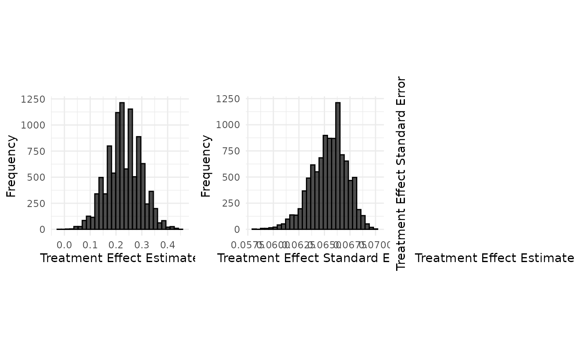

# Data Generation : Aprepitant case study (binary endpoint, summary measure as rate difference)

Source :

``` r

set.seed(42)

case_study_config <- yaml::yaml.load_file(system.file("conf/case_studies/aprepitant.yml", package = "RBExT"))
format_case_study_config(case_study_config)
```

[TABLE]

### Generation of aggregate data

``` r

source_data <- SourceData$new(case_study_config)

drift <- 0.1
target_sample_size_per_arm <- 100

target_data <- TargetDataFactory$new()
target_data <- target_data$create(source_data = source_data, case_study_config = case_study_config, target_sample_size_per_arm = target_sample_size_per_arm, treatment_drift = drift, summary_measure_likelihood = source_data$summary_measure_likelihood)
```

``` r

n_replicates <- 10000
data <- target_data$generate(n_replicates = n_replicates)
print(data[1:10,])
```

    ##    sample_control_rate sample_treatment_rate sample_size_per_arm
    ## 1                 0.45                  0.70                 100
    ## 2                 0.46                  0.69                 100
    ## 3                 0.46                  0.78                 100
    ## 4                 0.49                  0.72                 100
    ## 5                 0.47                  0.74                 100
    ## 6                 0.61                  0.76                 100
    ## 7                 0.54                  0.73                 100
    ## 8                 0.58                  0.80                 100
    ## 9                 0.48                  0.74                 100
    ## 10                0.55                  0.73                 100
    ##    treatment_effect_estimate treatment_effect_standard_error standard_deviation
    ## 1                       0.25                      0.06763875          0.6763875
    ## 2                       0.23                      0.06799265          0.6799265
    ## 3                       0.32                      0.06480741          0.6480741
    ## 4                       0.23                      0.06719375          0.6719375
    ## 5                       0.27                      0.06644547          0.6644547
    ## 6                       0.15                      0.06483055          0.6483055
    ## 7                       0.19                      0.06674579          0.6674579
    ## 8                       0.22                      0.06352952          0.6352952
    ## 9                       0.26                      0.06648308          0.6648308
    ## 10                      0.18                      0.06667833          0.6667833

``` r

target_data$plot_sample(data)
```



### Implementation details

``` r

read_function_code(sample_aggregate_binary_data)
```

    ## sample_aggregate_binary_data <- function (rate, n, n_replicates) 
    ## {
    ##     n_successes <- rbinom(n_replicates, n, rate)
    ##     return(n_successes/n)
    ## }

``` r

sample_treatment_rate <- sample_aggregate_binary_data(self$treatment_rate,
                                                              self$sample_size_per_arm,
                                                              n_replicates)

sample_control_rate <- sample_aggregate_binary_data(self$control_rate,
                                                    self$sample_size_per_arm,
                                                    n_replicates)

treatment_effect_standard_error <- sqrt(
  sample_treatment_rate * (1 - sample_treatment_rate) / self$sample_size_control + sample_control_rate * (1 - sample_control_rate) / self$sample_size_treatment
)

standard_deviation <- sqrt(
  sample_treatment_rate * (1 - sample_treatment_rate) + sample_control_rate * (1 - sample_control_rate)
)
```
