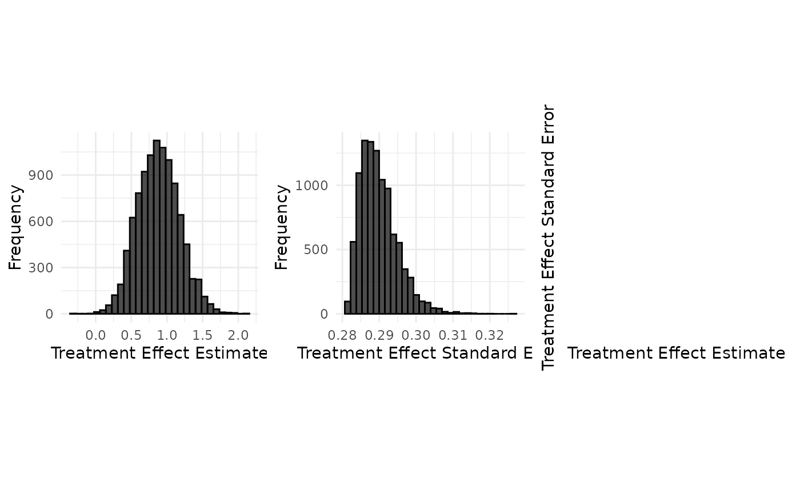
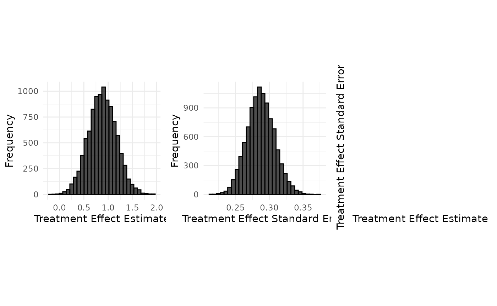

# Data Generation : Belimumab case study (binary endpoint)

## Belimumab case study

``` r

set.seed(42)
case_study_config <- yaml::yaml.load_file(system.file("conf/case_studies/belimumab.yml", package = "RBExT"))
format_case_study_config(case_study_config)
```

[TABLE]

## Initializing a BinaryTargetData object with a normal treatment effect summary measure distribution

``` r

source_data <- SourceData$new(case_study_config)

drift <- 0.4
target_sample_size_per_arm <- 100
```

We start by computing the rate in each arm, based on the drift in each
arm (defined on the log scale). By default, the drift in the control arm
is 0.

``` r

read_function_code(rate_from_drift_logOR)
```

    ## rate_from_drift_logOR <- function (arm_drift, source_rate) 
    ## {
    ##     source_odds <- source_rate/(1 - source_rate)
    ##     exp_arm_drift <- exp(arm_drift)
    ##     p_target <- exp_arm_drift/(exp_arm_drift + 1/source_odds)
    ##     if (exp_arm_drift == Inf && source_odds != 0) {
    ##         p_target <- 1
    ##     }
    ##     return(p_target)
    ## }

``` r

control_drift <- 0
treatment_drift <- drift + control_drift

target_data <- BinaryTargetData$new(
  source_data = source_data,
  sampling_approximation = case_study_config$sampling_approximation,
  target_sample_size_per_arm = target_sample_size_per_arm,
  control_drift = control_drift,
  treatment_drift = treatment_drift,
  summary_measure_likelihood = case_study_config$summary_measure_likelihood
)

# Recompute the rates via the log odds ratio drift, for illustration.
target_data$control_rate <- rate_from_drift_logOR(control_drift, source_data$control_rate)
target_data$treatment_rate <- rate_from_drift_logOR(treatment_drift, source_data$treatment_rate)
```

### Computing the mean and standard deviation of the logOR distribution

This allows us to compute the sampling standard deviation of the log OR:

``` r

read_function_code(standard_error_log_odds_ratio)
```

    ## standard_error_log_odds_ratio <- function (n_control_nonresponders, n_treatment_nonresponders, 
    ##     n_control_responders, n_treatment_responders, continuity_correction = TRUE) 
    ## {
    ##     if (continuity_correction == TRUE) {
    ##         n_control_responders <- 0.5 + n_control_responders
    ##         n_treatment_responders <- 0.5 + n_treatment_responders
    ##         n_control_nonresponders <- 0.5 + n_control_nonresponders
    ##         n_treatment_nonresponders <- 0.5 + n_treatment_nonresponders
    ##     }
    ##     return(sqrt(1/n_control_nonresponders + 1/n_treatment_nonresponders + 
    ##         1/n_control_responders + 1/n_treatment_responders))
    ## }

Computing the mean the logOR distribution:

``` r

target_data$treatment_effect <- target_data$drift + source_data$treatment_effect_estimate
```

## Aggregate data generation

### Generation of aggregate data without sampling approximation

#### Usage

``` r

case_study_config$sampling_approximation <- FALSE
target_data <- TargetDataFactory$new()
target_data <- target_data$create(source_data = source_data, case_study_config = case_study_config, target_sample_size_per_arm = target_sample_size_per_arm, treatment_drift = drift, summary_measure_likelihood = source_data$summary_measure_likelihood)
```

``` r

n_replicates <- 10000
data <- target_data$generate(n_replicates = n_replicates)
print(data[1:10,])
```

    ##    treatment_effect_estimate treatment_effect_standard_error
    ## 1                  0.3577034                       0.2826928
    ## 2                  0.6831790                       0.2863041
    ## 3                  0.6814880                       0.2859154
    ## 4                  0.3206737                       0.2837651
    ## 5                  0.2015345                       0.2841780
    ## 6                  1.0112073                       0.2904974
    ## 7                  0.5219859                       0.2850312
    ## 8                  0.6393069                       0.2851016
    ## 9                  0.8992529                       0.2909667
    ## 10                 0.9690166                       0.2897379
    ##    sample_size_per_arm standard_deviation
    ## 1                  100           2.826928
    ## 2                  100           2.863041
    ## 3                  100           2.859154
    ## 4                  100           2.837651
    ## 5                  100           2.841780
    ## 6                  100           2.904974
    ## 7                  100           2.850312
    ## 8                  100           2.851016
    ## 9                  100           2.909667
    ## 10                 100           2.897379

``` r

target_data$plot_sample(data)
```



#### Implementation details

``` r

read_function_code(compute_ORs)
```

    ## compute_ORs <- function (n_control, n_treatment, n_control_responders, n_treatment_responders) 
    ## {
    ##     n_control_nonresponders <- n_control - n_control_responders
    ##     n_treatment_nonresponders <- n_treatment - n_treatment_responders
    ##     log_odds_ratio <- compute_log_odds_ratio_from_counts(n_control_responders, 
    ##         n_treatment_responders, n_control - n_control_responders, 
    ##         n_treatment - n_treatment_responders, continuity_correction = TRUE)
    ##     std_err_log_odds_ratio <- standard_error_log_odds_ratio(n_control - 
    ##         n_control_responders, n_treatment - n_treatment_responders, 
    ##         n_control_responders, n_treatment_responders, continuity_correction = TRUE)
    ##     odds_ratio_dict <- list(log_odds_ratio = log_odds_ratio, 
    ##         treatment_rate = n_treatment_responders/n_treatment, 
    ##         control_rate = n_control_responders/n_control, std_err_log_odds_ratio = std_err_log_odds_ratio)
    ##     return(odds_ratio_dict)
    ## }

``` r

read_function_code(sample_log_odds_ratios)
```

    ## sample_log_odds_ratios <- function (n_control, n_treatment, treatment_rate, control_rate, 
    ##     n_replicates) 
    ## {
    ##     n_treatment_responders <- rbinom(n_replicates, n_treatment, 
    ##         treatment_rate)
    ##     n_control_responders <- rbinom(n_replicates, n_control, control_rate)
    ##     return(compute_ORs(n_control, n_treatment, n_control_responders, 
    ##         n_treatment_responders))
    ## }

``` r

log_OR_samples <- sample_log_odds_ratios(
  target_data$sample_size_control,
  target_data$sample_size_treatment,
  target_data$treatment_rate,
  target_data$control_rate,
  n_replicates
)

samples <- data.frame(
  treatment_effect_estimate = log_OR_samples$log_odds_ratio,
  treatment_effect_standard_error = log_OR_samples$std_err_log_odds_ratio,
  sample_size_per_arm = target_data$sample_size_per_arm
)
```

### Generation of aggregate data using a Gaussian approximation.

#### Usage

``` r

case_study_config$sampling_approximation <- TRUE

target_data <- TargetDataFactory$new()
target_data <- target_data$create(source_data = source_data, case_study_config = case_study_config, target_sample_size_per_arm = target_sample_size_per_arm, treatment_drift = drift, summary_measure_likelihood = source_data$summary_measure_likelihood)
```

``` r

n_replicates <- 10000
data <- target_data$generate(n_replicates = n_replicates)
print(data[1:10,])
```

    ##    treatment_effect_estimate treatment_effect_standard_error
    ## 1                  0.4833732                       0.2747903
    ## 2                  1.3913941                       0.3028210
    ## 3                  1.0131897                       0.2639542
    ## 4                  1.2333501                       0.2750998
    ## 5                  1.2599497                       0.2879706
    ## 6                  0.9392297                       0.2968109
    ## 7                  0.4803110                       0.2694182
    ## 8                  0.1331954                       0.2635918
    ## 9                  1.0283824                       0.3136427
    ## 10                 0.8584278                       0.2578315
    ##    sample_size_per_arm standard_deviation
    ## 1                  100           2.747903
    ## 2                  100           3.028210
    ## 3                  100           2.639542
    ## 4                  100           2.750998
    ## 5                  100           2.879706
    ## 6                  100           2.968109
    ## 7                  100           2.694182
    ## 8                  100           2.635918
    ## 9                  100           3.136427
    ## 10                 100           2.578315

``` r

target_data$plot_sample(data)
```



Notice how the sampling approximation leads to a similar distribution of
the treament effect estimate, but to a very different distribution of
the treatment effect standard error.

#### Implementation details

``` r

read_function_code(sample_aggregate_normal_data)
```

    ## sample_aggregate_normal_data <- function (mean, variance, n_replicates, n_samples_per_arm) 
    ## {
    ##     sample_mean <- rnorm(n_replicates, mean = mean, sd = sqrt(variance/n_samples_per_arm))
    ##     if (n_samples_per_arm > 1) {
    ##         degrees_of_freedom <- n_samples_per_arm - 1
    ##         sample_variance <- variance * rchisq(n_replicates, df = degrees_of_freedom)/degrees_of_freedom
    ##     }
    ##     else {
    ##         sample_variance <- rep(NA_real_, n_replicates)
    ##     }
    ##     sample_standard_error <- sqrt(sample_variance/n_samples_per_arm)
    ##     samples <- data.frame(treatment_effect_estimate = sample_mean, 
    ##         treatment_effect_standard_error = sample_standard_error, 
    ##         sample_size_per_arm = n_samples_per_arm, standard_deviation = sqrt(sample_variance))
    ##     return(samples)
    ## }

See
[Data_generation_botox](https://quinten-health-os.github.io/BayesianExtrapolationSimulation/articles/doc/Data_generation_botox.md)
for details on aggregate normal data generation.
