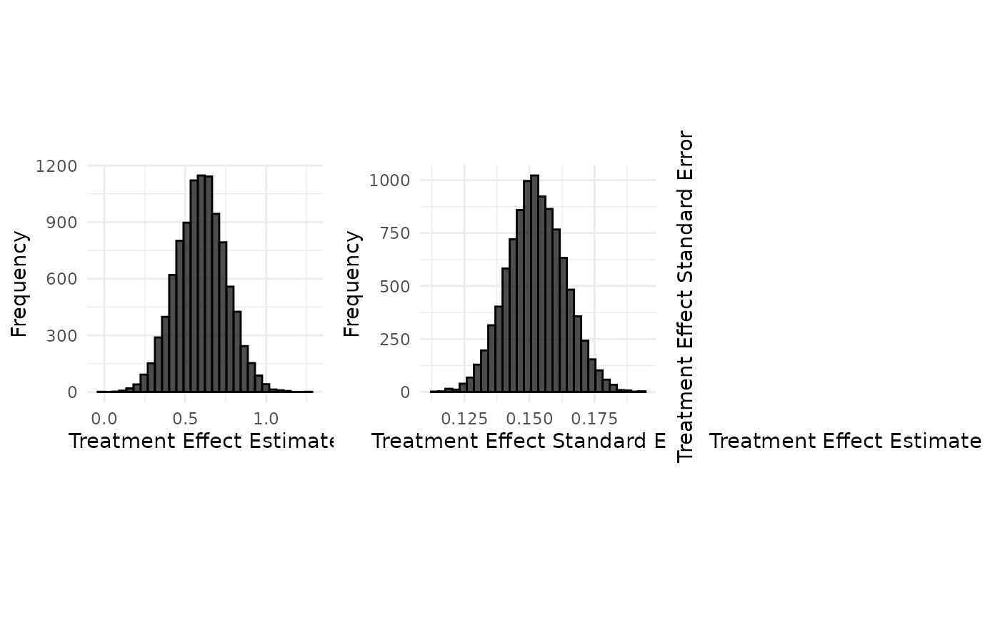
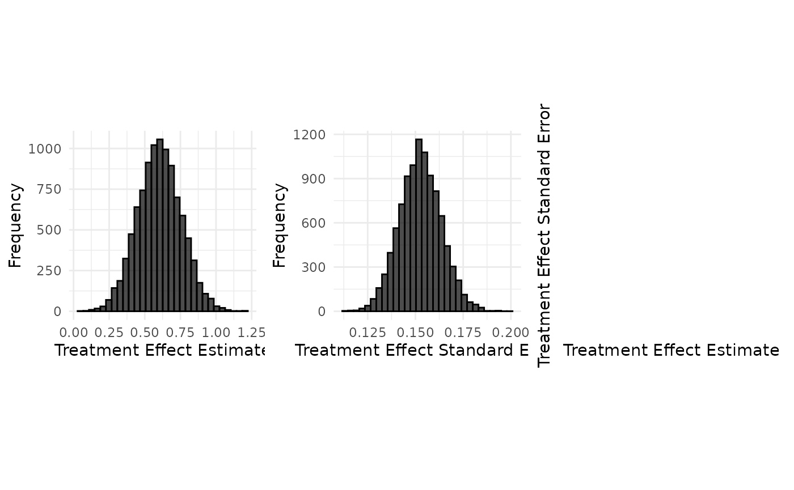

# Data Generation : Botox case study (continuous endpoint)

``` r

set.seed(42)

case_study_config <- yaml::yaml.load_file(system.file("conf/case_studies/botox.yml", package = "RBExT"))
format_case_study_config(case_study_config)
```

[TABLE]

### Generation of aggregate data

``` r

source_data <- SourceData$new(case_study_config)

drift <- 0.4
target_sample_size_per_arm <- 100

target_data <- TargetDataFactory$new()
target_data <- target_data$create(source_data = source_data, case_study_config = case_study_config, target_sample_size_per_arm = target_sample_size_per_arm, treatment_drift = drift, summary_measure_likelihood = source_data$summary_measure_likelihood)
```

``` r

n_replicates <- 10000
data <- target_data$generate(n_replicates = n_replicates)
print(data[1:10,])
```

    ##    treatment_effect_estimate treatment_effect_standard_error
    ## 1                  0.8097144                       0.1648389
    ## 2                  0.5136186                       0.1501266
    ## 3                  0.6555475                       0.1506688
    ## 4                  0.6968085                       0.1599049
    ## 5                  0.6618406                       0.1345548
    ## 6                  0.5837662                       0.1598121
    ## 7                  0.8312163                       0.1689636
    ## 8                  0.5855201                       0.1607539
    ## 9                  0.9087566                       0.1455753
    ## 10                 0.5904067                       0.1382090
    ##    sample_size_per_arm standard_deviation
    ## 1                  100           1.648389
    ## 2                  100           1.501266
    ## 3                  100           1.506688
    ## 4                  100           1.599049
    ## 5                  100           1.345548
    ## 6                  100           1.598121
    ## 7                  100           1.689636
    ## 8                  100           1.607539
    ## 9                  100           1.455753
    ## 10                 100           1.382090

``` r

target_data$plot_sample(data)
```

 \###
Implementation details

``` r

read_function_code(sample_aggregate_normal_data)
```

    ## sample_aggregate_normal_data <- function (mean, variance, n_replicates, n_samples_per_arm) 
    ## {
    ##     sample_mean <- rnorm(n_replicates, mean = mean, sd = sqrt(variance/n_samples_per_arm))
    ##     if (n_samples_per_arm > 1) {
    ##         degrees_of_freedom <- n_samples_per_arm - 1
    ##         sample_variance <- variance * rchisq(n_replicates, df = degrees_of_freedom)/degrees_of_freedom
    ##     }
    ##     else {
    ##         sample_variance <- rep(NA_real_, n_replicates)
    ##     }
    ##     sample_standard_error <- sqrt(sample_variance/n_samples_per_arm)
    ##     samples <- data.frame(treatment_effect_estimate = sample_mean, 
    ##         treatment_effect_standard_error = sample_standard_error, 
    ##         sample_size_per_arm = n_samples_per_arm, standard_deviation = sqrt(sample_variance))
    ##     return(samples)
    ## }

``` r

samples <- sample_aggregate_normal_data(
  mean = target_data$treatment_effect,
  variance = target_data$standard_deviation^2,
  n_replicates = n_replicates,
  n_samples_per_arm = target_data$sample_size_per_arm
)

target_data$plot_sample(samples)
```


