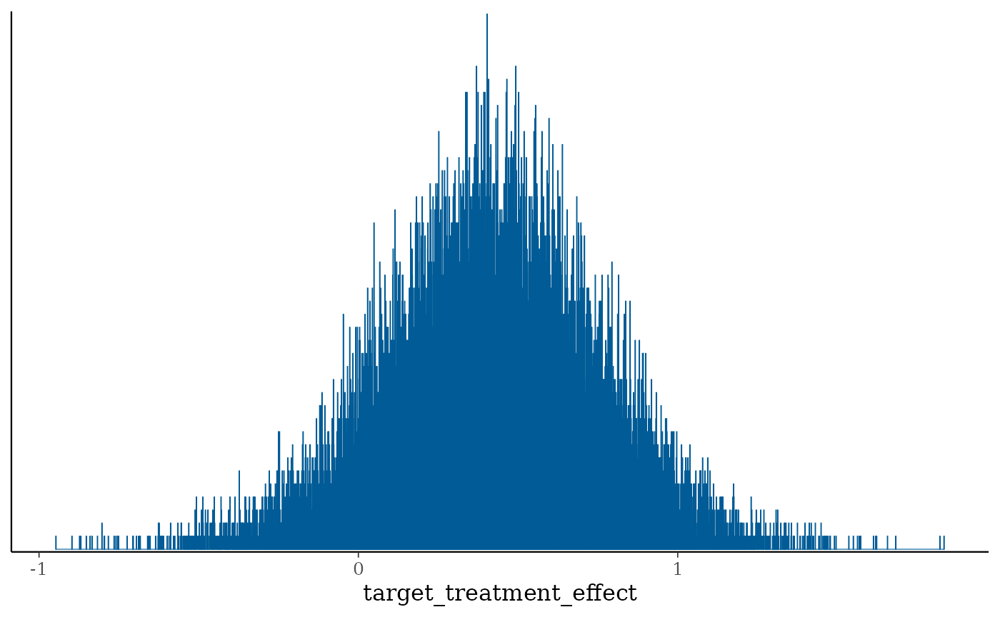
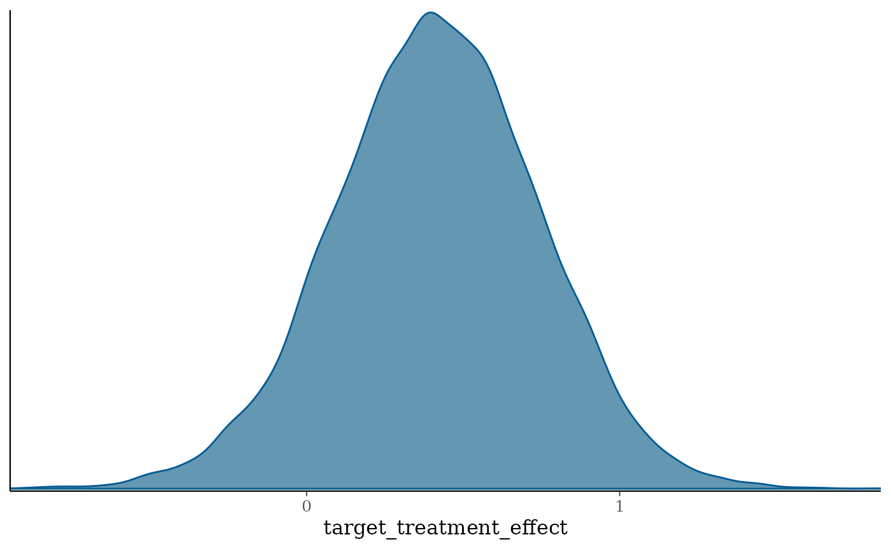
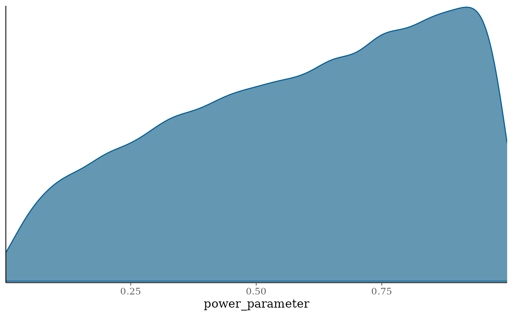
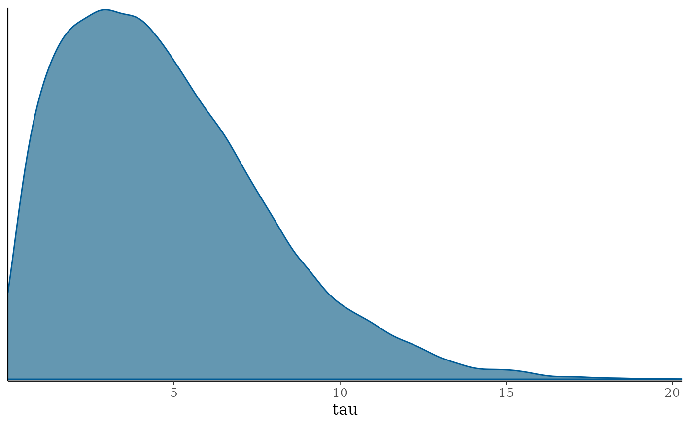
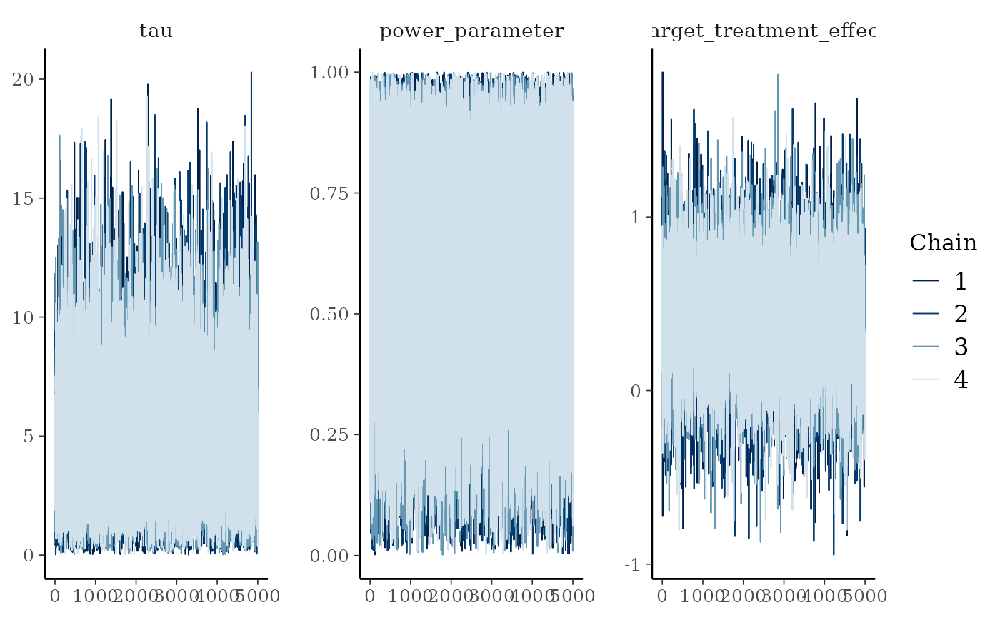
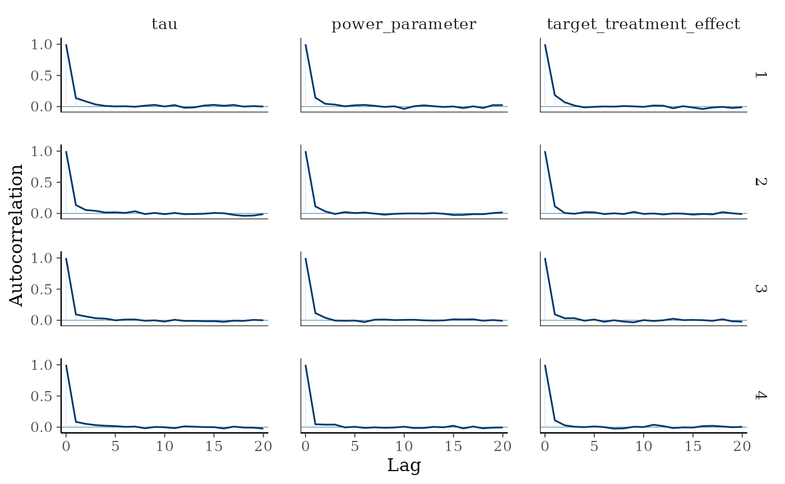

# Commensurate Power Prior

## Introduction

This vignette describes an implementation of the Commensurate Power
Prior.

## Set working directory, import functions and configurations

List packages to load, and install them if necessary.

## Mathematical description of the model

The location commensurate power prior is given by [Hobbs et al
(2011)](https://onlinelibrary.wiley.com/doi/10.1111/j.1541-0420.2011.01564.x):

``` math
 \pi(\theta_T, \gamma, \tau| \mathbf{D_S}) 
 = \int \pi(\theta_T|\theta_S, \tau) \frac{\mathcal{L}(\theta_S | \mathbf{D}_S)^\gamma \pi_0(\theta_S)}{\int \mathcal{L}(\theta_S | \mathbf{D}_S)^\gamma \pi_0(\theta_S) d\theta_S}d\theta_S \times p(\gamma|\tau) p(\tau) 
```

where $`\pi_0(\theta_S)`$ is an initial prior for $`\theta_S`$. Note
that, compared to equation (4) in [Hobbs et al
(2011)](https://onlinelibrary.wiley.com/doi/10.1111/j.1541-0420.2011.01564.x),
the prior differs slightly. Indeed, in this paper, the prior
$`\pi_0(\theta_S)`$ is omitted, and $`d\theta_S`$ is misplaced.

[Hobbs et al
(2011)](https://onlinelibrary.wiley.com/doi/10.1111/j.1541-0420.2011.01564.x)
chose the following distributions:

``` math
\theta_T|\theta_S, \tau \sim \mathcal{N}\left(\theta_S, \frac{1}{\tau}\right),
```

and

``` math
\gamma | \tau \sim Beta(g(\tau),1), 
```

where $`g(\tau)`$ is a positive function of $`\tau`$ that is small for
$`\tau`$ closed to zero and large for large values of $`\tau`$.

When the evidence for commensurability is weak, $`\tau`$ is forced
toward zero, increasing the variance of the commensurate prior for
$`\theta_T`$. So the amount of borrowing can be adapted in two ways:
through the specification of $`p(\gamma|\tau)`$, or $`p(\tau)`$.

## Gaussian case

[Hobbs et al
(2011)](https://onlinelibrary.wiley.com/doi/10.1111/j.1541-0420.2011.01564.x)
show that, in the Gaussian likelihood case (equation 9):

``` math
 p\left(\theta_T \mid \mathbf{D}_{S}, \mathbf{D}_T, \gamma, \tau, \sigma^2\right) \propto N\left(\theta_T \left\lvert\, \frac{\gamma N_S \tau \sigma^2 \hat{\theta}_S+N_T u \hat{\theta}_T}{\gamma N_S \tau \sigma^2+N_T u}\right., \frac{u \sigma^2}{\gamma N_S \tau \sigma^2+ N_T u}\right) 
```

where $`u=\gamma N_S+\hat{\sigma}_S^2 \tau`$, and
``` math
\begin{aligned}
p\left(\gamma, \tau \mid \mathbf{D}_S, \mathbf{D}_T, \sigma^2\right) \propto & N\left(\hat{\theta}_T-\hat{\theta}_S \mid 0, \frac{\sigma^2}{N_T}+\frac{1}{\tau}+\frac{\hat{\sigma}_S^2}{\gamma N_S}\right) \\
& \times \operatorname{Beta}\left(\gamma \mid g(\tau), 1\right) \times \pi(\tau) .
\end{aligned}
```

## Implementation of the model in Stan

``` r

case_study_config <- yaml::yaml.load_file(system.file("conf/case_studies/belimumab.yml", package = "RBExT"))


source_data <- ObservedSourceData$new(case_study_config)
summary_measure_likelihood <- case_study_config$summary_measure_likelihood
endpoint <- case_study_config$endpoint

target_data <- ObservedTargetData$new(treatment_effect_estimate = case_study_config$target$treatment_effect, treatment_effect_standard_error = case_study_config$target$standard_error, target_sample_size_per_arm = as.integer(case_study_config$target$total / 2), summary_measure_likelihood = case_study_config$summary_measure_likelihood)
```

``` r

method_parameters <- list(
  initial_prior = "noninformative", # This corresponds to the fact that the posterior for the adults data is derived from an uninformative prior (for consistency with other methods). May be removed in future releases.
  heterogeneity_prior = list(family = "inverse_gamma", alpha = 1 / 3, beta = 1) # list(family = "cauchy", location = 0, scale = 10)
  # list(family = "half_normal", std_dev = 1)
)

method_parameters <- list(
  initial_prior = "noninformative", # This corresponds to the fact that the posterior for the adults data is derived from an uninformative prior (for consistency with other methods). May be removed in future releases.
  heterogeneity_prior = # list(family = "cauchy", location = 0, scale = 1)
    list(family = "half_normal", std_dev = 5)
)

env = "full"
config_dir <- paste0(system.file(paste0("conf/", env), package = "RBExT"), "/")
mcmc_config <- yaml::read_yaml(paste0(config_dir, "/mcmc_config.yml"))

model <- Model$new()

model <- model$create(
  case_study_config = case_study_config,
  method = "commensurate_power_prior",
  method_parameters = method_parameters,
  source_data = source_data,
  mcmc_config = mcmc_config
)

print(model$stan_model_code)
```

    ## [1] "\n                                      functions {\n                                        real g_function(real log_tau) {\n                                          return fmax(log_tau, 1); // Define g(τ)\n                                        }\n                                      }\n\n                                      data {\n                                        int<lower=0,upper=2> prior_type; // Type of prior on the commensurability parameter; 0 for inverse_gamma, 1 for half normal, 2 for Cauchy\n                                        int<lower=1> NS;       // Number of samples in dataset S\n                                        int<lower=1> NT;       // Number of samples in dataset T\n                                        real<lower=0> target_sampling_variance;  // Known variance of the target data\n                                        real<lower=0> prior_variance; // Prior variance component\n                                        real source_treatment_effect_estimate;      // Estimate from dataset S\n                                        real target_treatment_effect_estimate;      // Estimate from dataset T\n                                        real std_dev; // Parameter for the half normal prior\n                                        real location; // Location parameter for the Cauchy prior\n                                        real scale; // Scale parameter for the Cauchy prior\n                                        real alpha; // Parameter for the inverse_gamma prior\n                                        real beta; // Pocation parameter for the inverse_gamma prior\n                                      }\n\n                                      parameters {\n                                        real<lower=0, upper=1> power_parameter;   // Power parameter\n                                        real<lower=0> tau;     // Commensurability parameter\n                                        real target_treatment_effect;          // Target treatment effect\n                                      }\n\n                                      model {\n                                        // Local to the model block: these are\n                                        // intermediate quantities, and declaring\n                                        // them as transformed parameters would\n                                        // write three extra columns per draw to\n                                        // the output CSV for no downstream use.\n                                        // Stan does not allow constraints on\n                                        // local declarations; both quantities are\n                                        // non-negative by construction here.\n                                        real u = power_parameter * NS + tau * prior_variance;\n                                        real tau2 = tau^2;\n                                        real log_tau = log(tau);\n                                        real marginal_variance = target_sampling_variance / NT\n                                                                  + 1 / tau\n                                                                  + prior_variance / (power_parameter * NS);\n\n                                        // Priors\n                                        if (prior_type == 0) {\n                                          tau2 ~ inv_gamma(alpha, beta);\n                                          // tau is the parameter and tau2 is a transform of it, so this\n                                          // statement needs the log Jacobian of tau -> tau^2, which is\n                                          // log(2 * tau). Without it the prior is InvGamma(alpha + 0.5, beta).\n                                          target += log(tau);\n                                        } else if (prior_type == 1){\n                                          // tau is the parameter itself, so Stan's own <lower=0> transform\n                                          // already supplies the Jacobian and the truncation normalises it.\n                                          tau ~ normal(0, std_dev) T[0, ];\n                                        } else if (prior_type == 2){\n                                          log_tau ~ cauchy(location, scale);\n                                          // Log Jacobian of tau -> log(tau). Without it the prior is improper.\n                                          target += -log_tau;\n                                        }\n\n\n                                        power_parameter ~ beta(g_function(log_tau), 1);\n\n                                        // Marginal target-data likelihood for the borrowing\n                                        // parameters. Together with the conditional distribution\n                                        // below, this gives the joint posterior from equation (9)\n                                        // of Hobbs et al. (2011). Omitting this term leaves tau and\n                                        // power_parameter distributed according to their priors.\n                                        target_treatment_effect_estimate ~ normal(\n                                          source_treatment_effect_estimate,\n                                          sqrt(marginal_variance));\n\n                                        target_treatment_effect ~ normal(\n    (power_parameter * NS * tau * target_sampling_variance * source_treatment_effect_estimate + NT * u * target_treatment_effect_estimate) /\n    (power_parameter * NS * tau * target_sampling_variance + NT * u),\n    sqrt((u * target_sampling_variance) / (power_parameter * NS * tau * target_sampling_variance + NT * u)));\n                                      }\n                                      "

``` r

model$inference(target_data)
```

In the inference method, the data are prepared for use with Stan using:

``` r

# Prepare the data for MCMC inference
data <- model$prepare_data(target_data)
```

Then, draws are sampled from the posterior following the configuration
specified in mcmc_config.

``` r

bayesplot::mcmc_hist(model$fit$draws("target_treatment_effect"), binwidth = 0.001)
```



``` r

posterior <- model$fit$draws("target_treatment_effect")
bayesplot::color_scheme_set("blue")
bayesplot::mcmc_dens(posterior, pars = c("target_treatment_effect"))
```


Posterior distribution of the power parameter:

``` r

posterior <- model$fit$draws("power_parameter")
bayesplot::color_scheme_set("blue")
bayesplot::mcmc_dens(posterior, pars = c("power_parameter"))
```



Posterior distribution of the heterogeneity parameter:

``` r

posterior <- model$fit$draws("tau")
bayesplot::color_scheme_set("blue")
bayesplot::mcmc_dens(posterior, pars = c("tau"))
```



``` r

library(posterior)
draws_array <- as_draws_array(model$fit)
```

``` r

library(bayesplot)
mcmc_trace(draws_array, pars = c("tau", "power_parameter", "target_treatment_effect"))
```



``` r

mcmc_acf(draws_array, pars = c("tau", "power_parameter", "target_treatment_effect"))
```



``` r

mcmc_diagnostics <- model$fit$diagnostic_summary()

n_draws <- mcmc_config$chain_length * mcmc_config$num_chains

# MCMC Effective Sample Size
mcmc_ess <- bayesplot::neff_ratio(model$fit) * n_draws

mcmc_ess <- mcmc_ess[["target_treatment_effect"]]
print(mcmc_ess)
```

    ## [1] 14670.31

``` r

bayesplot::neff_ratio(model$fit)
```

    ##         power_parameter                     tau target_treatment_effect 
    ##               0.7412430               0.6586232               0.7335153

``` r

rhat_values <- bayesplot::rhat(model$fit)
rhat <- rhat_values["target_treatment_effect"]
print(rhat)
```

    ## target_treatment_effect 
    ##                1.000068

``` r

# number of divergences reported is the sum of the per chain values
n_divergences <- sum(mcmc_diagnostics$num_divergent)
print(n_divergences)
```

    ## [1] 0
