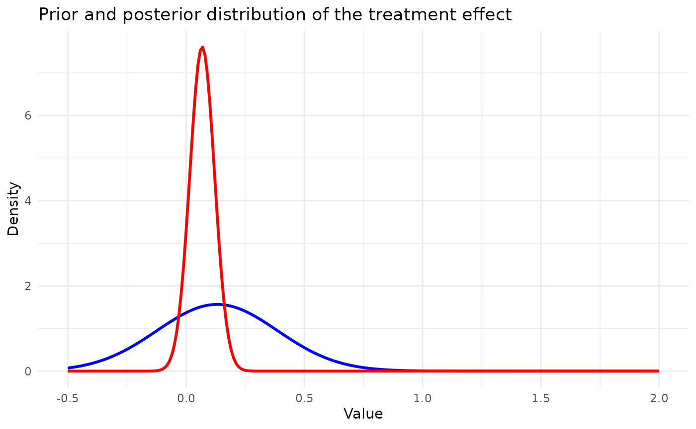
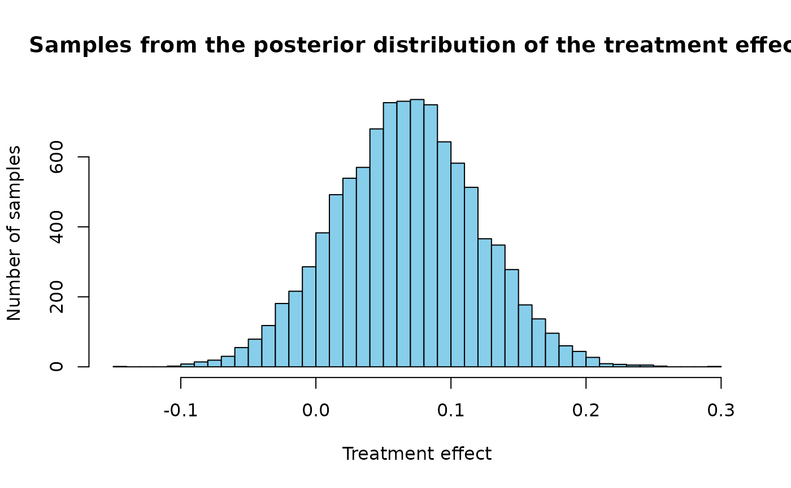

# Implementation of the PDCCPP

## Introduction

The aim of this document is to illustrate the PDCCPP ([Nikolakopoulos et
al (2018)](https://onlinelibrary.wiley.com/doi/10.1111/biom.12835)), the
empirical Bayes power prior (as proposed by [Gravestock et al
(2017)](https://onlinelibrary.wiley.com/doi/10.1002/pst.1814)), and the
p-value based power prior ([Liu et al,
(2018)](https://pubmed.ncbi.nlm.nih.gov/29125220/)).

## Set working directory, import functions

## Load the Belimumab case study configuration

Load the simulation configuration and the Belimumab case study
configuration from YAML files.

``` r

set.seed(42)
config_path <- system.file("conf/simulation_config.yml", package = "RBExT")
simulation_config <- yaml::yaml.load_file(config_path)

config_path <- system.file("conf/case_studies/aprepitant.yml", package = "RBExT")
case_study_config <- yaml::yaml.load_file(config_path)
```

## Create data objects

Create a source_data instance, where information about the source data
is stored

``` r

target_sample_size_per_arm <- as.integer(case_study_config$target$total / 2)
drift <- 0.4

source_data <- ObservedSourceData$new(case_study_config)
print(source_data)
```

    ## <ObservedSourceData>
    ##   Public:
    ##     clone: function (deep = FALSE) 
    ##     control_rate: 0.525597269624573
    ##     endpoint: binary
    ##     equivalent_source_sample_size_per_arm: 286.352530541012
    ##     initialize: function (case_study_config) 
    ##     sample_size_control: 293
    ##     sample_size_treatment: 280
    ##     standard_error: 0.0406899348413468
    ##     summary_measure_likelihood: binomial
    ##     to_dict: function () 
    ##     treatment_effect_estimate: 0.131545587518284
    ##     treatment_rate: 0.657142857142857

Set the observed target data (in the paediatrics population)

``` r

summary_measure_likelihood <- case_study_config$summary_measure_likelihood
endpoint <- case_study_config$endpoint
target_data <- ObservedTargetData$new(treatment_effect_estimate = case_study_config$target$treatment_effect, treatment_effect_standard_error = case_study_config$target$standard_error, target_sample_size_per_arm = as.integer(case_study_config$target$total / 2), summary_measure_likelihood = case_study_config$summary_measure_likelihood)
```

## PDCCPP

We note that the PDCCPP method was developed in the Gaussian case only,
assuming that the sampling standard deviation is known and is the same
in the source and target studies. However, in our simulation study, we
do not make this latter assumption. To reuse the code by [Nikolakopoulos
et al (2018)](https://onlinelibrary.wiley.com/doi/10.1111/biom.12835),
what we adapt the sample size per arm in the source study by replacing
it with an “effective sample size per arm at variance $`\sigma_T^2`$,
$`N_0`$: We set: $`N_0 = N_S\frac{\sigma_T^2}{\sigma_S^2}`$ So that
everything is equivalent to the case where the sampling std is
$`\sigma_T`$ in the target study and the source study, but with a sample
size per arm $`N_0`$ in the source study (instead of $`N_S`$)

``` r

method <- "PDCCPP"
method_parameters <- list(
  initial_prior = "noninformative", # This corresponds to the fact that the posterior for the adults data is derived from an uninformative prior (for consistency with other methods). May be removed in future releases.
  empirical_bayes = FALSE, # Corresponds to whether some parameters of the prior are based on observed data.
  desired_tie = 0.065,
  significance_level = 0.05,
  tolerance = 0.0001,
  n_iter = 1e6
)
```

Now, we define the model we want to use for inferring the treatment
effect in the target study.

``` r

env <- "full"
config_dir <- paste0(system.file(paste0("conf/", env), package = "RBExT"), "/")
mcmc_config <- yaml::read_yaml(paste0(config_dir, "/mcmc_config.yml"))

model <- Model$new()

model <- model$create(
  case_study_config = case_study_config,
  method = method,
  method_parameters = method_parameters,
  source_data = source_data,
  mcmc_config = mcmc_config
)
```

### Inference with the PDCCPP

To perform inference, we would simply use:

``` r

# Perform Bayesian inference based on observed target data.
model$inference(target_data = target_data)
```

    ## [1] "Success"

This inference steps set the following attributes which, taken together,
specify the posterior distribution.

``` r

print(model$wpost) # Posterior weight
```

    ## NULL

``` r

print(model$vague_posterior_mean)
```

    ## NULL

``` r

print(model$vague_posterior_variance)
```

    ## NULL

``` r

print(model$info_posterior_mean)
```

    ## NULL

``` r

print(model$info_posterior_variance)
```

    ## NULL

Now, let us see how this is implemented:

``` r

read_function_code(model$inference)
```

    ## $ <- function (target_data) 
    ## {
    ##     self$empirical_bayes_update(target_data)
    ##     return(super$inference(target_data))
    ## } model <- function (target_data) 
    ## {
    ##     self$empirical_bayes_update(target_data)
    ##     return(super$inference(target_data))
    ## } inference <- function (target_data) 
    ## {
    ##     self$empirical_bayes_update(target_data)
    ##     return(super$inference(target_data))
    ## }

The first step in inference is to update the prior based on target_data
if needed, in case where the method uses empirical Bayes. With empirical
Bayes, some parameters of the prior are set based on observed target
data. The second step is to compute the moments of the treatment effect
posterior distribution. Note that we use the same inference function for
all methods/scenarios combinations that do not require MCMC (in which
case we need samples from the posterior and not only the parameters of
the posterior).

In the study protocol, we specified that the variance of the vague
component of the RMP should be such that this prior corresponds to the
information provided by a single subject per arm in the target study.
This is a form of empirical Bayes:

``` r

read_function_code(model$empirical_bayes_update)
```

    ## $ <- function (target_data) 
    ## {
    ##     if (target_data$sample$treatment_effect_standard_error == 
    ##         Inf) {
    ##         stop("The standard error on the treatment effect is Inf")
    ##     }
    ##     self$posterior_parameters$power_parameter <- self$power_parameter_estimation(target_data = target_data)
    ##     self$prior_var <- (self$prior$source$standard_error^2)/self$posterior_parameters$power_parameter
    ##     if (self$posterior_parameters$power_parameter != 0) {
    ##         self$prior_var <- (self$prior$source$standard_error^2)/self$posterior_parameters$power_parameter
    ##     }
    ##     else {
    ##         self$prior_var <- 1000
    ##     }
    ##     if (is.numeric(self$prior_var) && length(self$prior_var) == 
    ##         0) {
    ##         stop("self$prior_var is numeric(0)")
    ##     }
    ## } model <- function (target_data) 
    ## {
    ##     if (target_data$sample$treatment_effect_standard_error == 
    ##         Inf) {
    ##         stop("The standard error on the treatment effect is Inf")
    ##     }
    ##     self$posterior_parameters$power_parameter <- self$power_parameter_estimation(target_data = target_data)
    ##     self$prior_var <- (self$prior$source$standard_error^2)/self$posterior_parameters$power_parameter
    ##     if (self$posterior_parameters$power_parameter != 0) {
    ##         self$prior_var <- (self$prior$source$standard_error^2)/self$posterior_parameters$power_parameter
    ##     }
    ##     else {
    ##         self$prior_var <- 1000
    ##     }
    ##     if (is.numeric(self$prior_var) && length(self$prior_var) == 
    ##         0) {
    ##         stop("self$prior_var is numeric(0)")
    ##     }
    ## } empirical_bayes_update <- function (target_data) 
    ## {
    ##     if (target_data$sample$treatment_effect_standard_error == 
    ##         Inf) {
    ##         stop("The standard error on the treatment effect is Inf")
    ##     }
    ##     self$posterior_parameters$power_parameter <- self$power_parameter_estimation(target_data = target_data)
    ##     self$prior_var <- (self$prior$source$standard_error^2)/self$posterior_parameters$power_parameter
    ##     if (self$posterior_parameters$power_parameter != 0) {
    ##         self$prior_var <- (self$prior$source$standard_error^2)/self$posterior_parameters$power_parameter
    ##     }
    ##     else {
    ##         self$prior_var <- 1000
    ##     }
    ##     if (is.numeric(self$prior_var) && length(self$prior_var) == 
    ##         0) {
    ##         stop("self$prior_var is numeric(0)")
    ##     }
    ## }

The posterior is given by :

``` math
p(\theta_T | \boldsymbol{y}_S, \boldsymbol{y}_T) = \widetilde{w}\mathcal{N}\left(\theta_T \bigg| \frac{\mu_v}{N_T\frac{\sigma^2_v}{\sigma^2_T} + 1} + \frac{\overline{y}_T}{\frac{\sigma^2_T}{N_T\sigma_v^2} + 1}, \left(\sigma_v^{-2} + \frac{N_T}{\sigma^2_T} \right)^{-1}\right) + (1- \widetilde{w})\mathcal{N}\left(\theta_T \bigg| \frac{\overline{y}_S}{N_T\frac{\nu^2_S}{\sigma^2_T} + 1} + \frac{\overline{y}_T}{\frac{\sigma^2_T}{N_T\nu_S^2} + 1}, \left(\nu_S^{-2} + \frac{N_T}{\sigma^2_T} \right)^{-1}\right),
```

where $`\mathcal{N}(\theta_T | \mu, \sigma^2)`$ denotes the probability
density function of a normal distribution with mean $`\mu`$ and variance
$`\sigma^2`$, evaluated at $`\theta_T`$.

The code to compute the posterior moments is the following :

``` r

read_function_code(model$posterior_moments)
```

    ## $ <- function (target_data) 
    ## {
    ##     self$post_mean <- self$posterior_mean(target_data)
    ##     self$post_var <- self$posterior_variance(target_data)
    ## } model <- function (target_data) 
    ## {
    ##     self$post_mean <- self$posterior_mean(target_data)
    ##     self$post_var <- self$posterior_variance(target_data)
    ## } posterior_moments <- function (target_data) 
    ## {
    ##     self$post_mean <- self$posterior_mean(target_data)
    ##     self$post_var <- self$posterior_variance(target_data)
    ## }

With :

``` r

read_function_code(model$posterior_mean)
```

    ## $ <- function (target_data) 
    ## {
    ##     post_mean <- (self$prior_mean/(self$prior_var/target_data$sample$treatment_effect_standard_error^2 + 
    ##         1)) + (target_data$sample$treatment_effect_estimate/(1 + 
    ##         target_data$sample$treatment_effect_standard_error^2/self$prior_var))
    ##     assertions::assert_number(post_mean)
    ##     return(post_mean)
    ## } model <- function (target_data) 
    ## {
    ##     post_mean <- (self$prior_mean/(self$prior_var/target_data$sample$treatment_effect_standard_error^2 + 
    ##         1)) + (target_data$sample$treatment_effect_estimate/(1 + 
    ##         target_data$sample$treatment_effect_standard_error^2/self$prior_var))
    ##     assertions::assert_number(post_mean)
    ##     return(post_mean)
    ## } posterior_mean <- function (target_data) 
    ## {
    ##     post_mean <- (self$prior_mean/(self$prior_var/target_data$sample$treatment_effect_standard_error^2 + 
    ##         1)) + (target_data$sample$treatment_effect_estimate/(1 + 
    ##         target_data$sample$treatment_effect_standard_error^2/self$prior_var))
    ##     assertions::assert_number(post_mean)
    ##     return(post_mean)
    ## }

and :

``` r

read_function_code(model$posterior_variance)
```

    ## $ <- function (target_data) 
    ## {
    ##     return(1/(1/self$prior_var + 1/target_data$sample$treatment_effect_standard_error^2))
    ## } model <- function (target_data) 
    ## {
    ##     return(1/(1/self$prior_var + 1/target_data$sample$treatment_effect_standard_error^2))
    ## } posterior_variance <- function (target_data) 
    ## {
    ##     return(1/(1/self$prior_var + 1/target_data$sample$treatment_effect_standard_error^2))
    ## }

The variance of a mixture of two distributions is given by :

``` r

read_function_code(model$mixture_variance)
```

    ## $ <- NULL model <- NULL mixture_variance <- NULL

A crucial aspect of this inference step is the computation of the
posterior mixture weights:

The posterior weight of the vague component $`\widetilde{w}`$ is given
by:

``` math
    \tilde{w} = \frac{wC_v}{wC_v + (1-w)C_S}
```
Where $`C_v`$ and $`C_S`$ are proportional to the marginal likelihood
(or prior predictive probability) of the aggregate data for each
Gaussian component:
``` math
C_v =  \frac{1}{\sqrt{\sigma_v^2 + \sigma^2_T/N_T}}\exp\left(-\frac{1}{2}\frac{(\overline{y}_T - \mu_v)^2}{\sqrt{\sigma_v^2 + \sigma^2_T/N_T}}\right)
```
and :
``` math
C_S =  \frac{1}{\sqrt{\nu_S^2 + \sigma^2_T/N_T}}\exp\left(-\frac{1}{2}\frac{(\overline{y}_T - \overline{y}_S)^2}{\sqrt{\nu_S^2 + \sigma^2_T/N_T}}\right)
```

``` r

read_function_code(model$posterior_pdf)
```

    ## $ <- function (target_treatment_effect) 
    ## {
    ##     dnorm(target_treatment_effect, mean = self$post_mean, sd = sqrt(self$post_var))
    ## } model <- function (target_treatment_effect) 
    ## {
    ##     dnorm(target_treatment_effect, mean = self$post_mean, sd = sqrt(self$post_var))
    ## } posterior_pdf <- function (target_treatment_effect) 
    ## {
    ##     dnorm(target_treatment_effect, mean = self$post_mean, sd = sqrt(self$post_var))
    ## }

``` r

read_function_code(model$posterior_cdf)
```

    ## $ <- function (target_treatment_effect) 
    ## {
    ##     pnorm(target_treatment_effect, mean = self$post_mean, sd = sqrt(self$post_var))
    ## } model <- function (target_treatment_effect) 
    ## {
    ##     pnorm(target_treatment_effect, mean = self$post_mean, sd = sqrt(self$post_var))
    ## } posterior_cdf <- function (target_treatment_effect) 
    ## {
    ##     pnorm(target_treatment_effect, mean = self$post_mean, sd = sqrt(self$post_var))
    ## }

Let us plot the posterior pdf :

``` r

library(ggplot2)
x_values <- seq(-0.5, 2, by = 0.01) # Range of values for x

prior_pdf <- model$prior_pdf(x_values)
posterior_pdf <- model$posterior_pdf(x_values)

df <- data.frame(x = x_values, prior_pdf = prior_pdf, posterior_pdf = posterior_pdf)

# Use ggplot2 to plot both PDFs on the same plot
ggplot2::ggplot(df, ggplot2::aes(x = x)) +
  geom_line(ggplot2::aes(y = prior_pdf), color = "blue", size = 1) +
  geom_line(ggplot2::aes(y = posterior_pdf), color = "red", size = 1) +
  ggplot2::labs(
    title = "Prior and posterior distribution of the treatment effect",
    x = "Value",
    y = "Density",
    labels = c("Prior pdf", "Posterior pdf")
  ) +
  theme_minimal() +
  scale_color_manual(values = c("blue", "red")) +
  guides(color = guide_legend(title = NULL)) +
  scale_fill_manual(
    name = "PDF of the robust mixture of Gaussians",
    labels = c("Prior pdf", "Posterior pdf"),
    values = c("blue", "red")
  )
```



Being able to sample from the posterior is crucial for estimating
quantiles, we use the following:.

``` r

read_function_code(model$sample_posterior)
```

    ## $ <- function (n_samples) 
    ## {
    ##     rnorm(n_samples, mean = self$post_mean, sd = sqrt(self$post_var))
    ## } model <- function (n_samples) 
    ## {
    ##     rnorm(n_samples, mean = self$post_mean, sd = sqrt(self$post_var))
    ## } sample_posterior <- function (n_samples) 
    ## {
    ##     rnorm(n_samples, mean = self$post_mean, sd = sqrt(self$post_var))
    ## }

Illustration of this sampling approach:

``` r

samples <- model$sample_posterior(10000)
hist(samples, breaks = 60, col = "skyblue", main = "Samples from the posterior distribution of the treatment effect", xlab = "Treatment effect", ylab = "Number of samples")
```



``` r

sessionInfo()
```

    ## R version 4.2.0 (2022-04-22)
    ## Platform: x86_64-pc-linux-gnu (64-bit)
    ## Running under: Ubuntu 24.04.5 LTS
    ## 
    ## Matrix products: default
    ## BLAS:   /usr/lib/x86_64-linux-gnu/openblas-pthread/libblas.so.3
    ## LAPACK: /usr/lib/x86_64-linux-gnu/openblas-pthread/libopenblasp-r0.3.26.so
    ## 
    ## locale:
    ##  [1] LC_CTYPE=C.UTF-8       LC_NUMERIC=C           LC_TIME=C.UTF-8       
    ##  [4] LC_COLLATE=C.UTF-8     LC_MONETARY=C.UTF-8    LC_MESSAGES=C.UTF-8   
    ##  [7] LC_PAPER=C.UTF-8       LC_NAME=C              LC_ADDRESS=C          
    ## [10] LC_TELEPHONE=C         LC_MEASUREMENT=C.UTF-8 LC_IDENTIFICATION=C   
    ## 
    ## attached base packages:
    ## [1] stats     graphics  grDevices datasets  utils     methods   base     
    ## 
    ## other attached packages:
    ## [1] ggplot2_4.0.3 RBExT_0.0.2  
    ## 
    ## loaded via a namespace (and not attached):
    ##   [1] matrixStats_1.5.0    fs_2.1.0             assertions_0.3.0    
    ##   [4] progress_1.2.3       doParallel_1.0.17    RColorBrewer_1.1-3  
    ##   [7] rstan_2.32.7         latex2exp_0.9.8      tensorA_0.36.2.1    
    ##  [10] tools_4.2.0          backports_1.5.1      bslib_0.12.0        
    ##  [13] R6_2.6.1             otel_0.2.0           withr_3.0.3         
    ##  [16] prettyunits_1.2.0    tidyselect_1.2.1     gridExtra_2.3.1     
    ##  [19] processx_3.9.0       compiler_4.2.0       extrafontdb_1.1     
    ##  [22] textshaping_1.0.5    cli_3.6.6            HDInterval_0.2.4    
    ##  [25] xml2_1.6.0           desc_1.4.3           labeling_0.4.3      
    ##  [28] posterior_1.7.1      sass_0.4.10          scales_1.4.0        
    ##  [31] checkmate_2.3.4      mvtnorm_1.4-2        S7_0.2.2            
    ##  [34] readr_2.2.0          pkgdown_2.2.1        QuickJSR_1.11.0     
    ##  [37] systemfonts_1.3.2    stringr_1.6.0        digest_0.6.39       
    ##  [40] StanHeaders_2.39.1   rmarkdown_2.32       svglite_2.2.2       
    ##  [43] pkgconfig_2.0.3      htmltools_0.5.9      extrafont_0.20      
    ##  [46] fastmap_1.2.0        pwr_1.3-0            htmlwidgets_1.6.4   
    ##  [49] rlang_1.3.0          rstudioapi_0.19.0    jquerylib_0.1.4     
    ##  [52] farver_2.1.2         generics_0.1.4       jsonlite_2.0.0      
    ##  [55] dplyr_1.2.1          distributional_0.9.0 inline_0.3.21       
    ##  [58] magrittr_2.0.5       kableExtra_1.4.1     Formula_1.2-6       
    ##  [61] loo_2.10.1.9000      Rcpp_1.1.2           abind_1.4-8         
    ##  [64] viridis_0.6.5        lifecycle_1.0.5      stringi_1.8.9       
    ##  [67] yaml_2.3.12          pkgbuild_1.4.8       grid_4.2.0          
    ##  [70] parallel_4.2.0       crayon_1.5.3         hms_1.1.4           
    ##  [73] knitr_1.52           ps_1.9.3             pillar_1.11.1       
    ##  [76] codetools_0.2-18     stats4_4.2.0         rstantools_2.7.1    
    ##  [79] glue_1.8.1           evaluate_1.0.5       renv_1.0.11         
    ##  [82] RcppParallel_6.2.1   vctrs_0.7.3          tzdb_0.5.0          
    ##  [85] Rdpack_2.6.6         foreach_1.5.2        Rttf2pt1_1.3.14     
    ##  [88] gtable_0.3.6         purrr_1.2.2          tidyr_1.3.2         
    ##  [91] assertthat_0.2.1     cachem_1.1.0         xfun_0.60           
    ##  [94] rbibutils_2.4.1      tidyverse_2.0.0      roxygen2_8.1.0      
    ##  [97] ragg_1.5.2           viridisLite_0.4.3    truncnorm_1.0-9     
    ## [100] Bolstad2_1.0-29      RBesT_1.11-0         tibble_3.3.1        
    ## [103] iterators_1.0.14     cmdstanr_0.9.0
