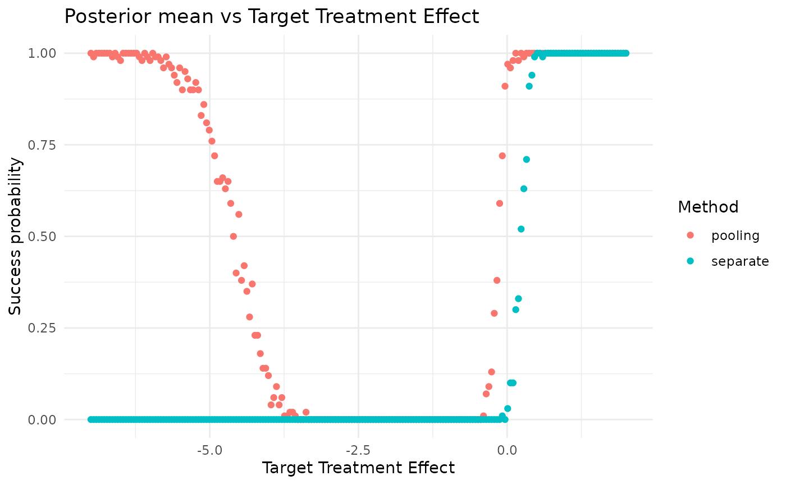
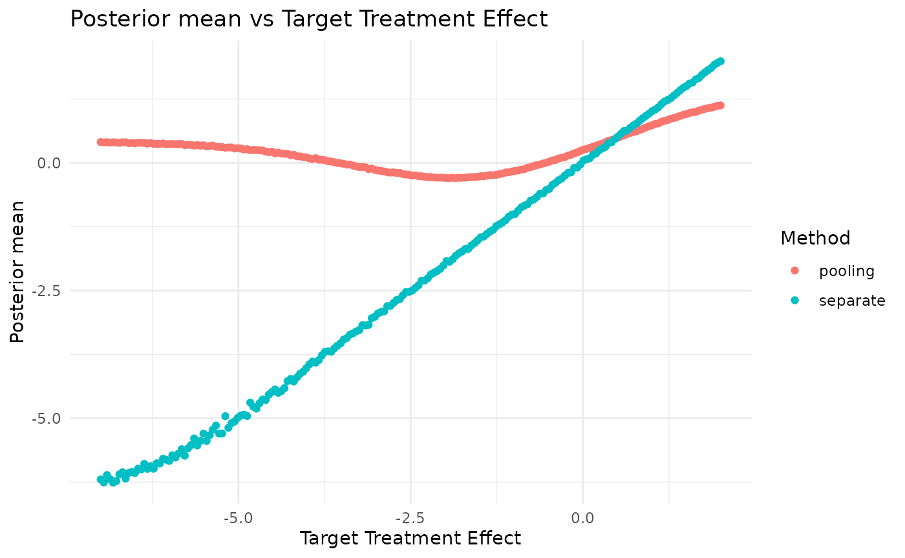
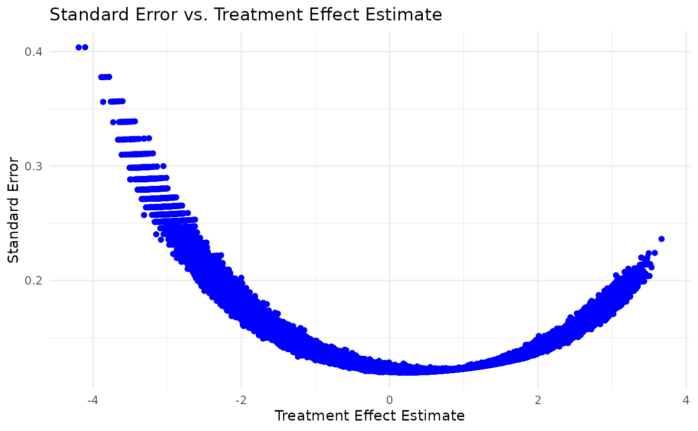

# Pooling

## Set working directory and load packages

## Load the case study configuration

Load the simulation configuration and the Belimumab case study
configuration from YAML files.

``` r

set.seed(42)
simulation_config <- yaml::yaml.load_file(system.file("conf/simulation_config.yml", package = "RBExT"))

case_study <- "belimumab"
case_study_config <- yaml::yaml.load_file(system.file("conf/case_studies/belimumab.yml", package = "RBExT"))
```

## Method and scenario

Create a source_data instance, where information about the source data
is stored

``` r

source_data <- SourceData$new(case_study_config)

target_sample_size_per_arm <- as.integer(case_study_config$source$total / 2)
```

``` r

method <- "pooling"
method_parameters <- list(
  initial_prior = "noninformative", # This corresponds to the fact that the posterior for the adults data is derived from an uninformative prior (for consistency with other methods).
  empirical_bayes = FALSE # Corresponds to whether some parameters of the prior are based on observed data.
)
```

Now, we define the model we want to use for inferring the treatment
effect in the target study.

``` r

model <- Model$new()

model <- model$create(
  case_study_config = case_study_config,
  method = method,
  method_parameters = method_parameters,
  source_data = source_data
)
```

### Simulation

Separate analysis:

``` r

separate_method <- "separate"
method_parameters <- list(
  initial_prior = "noninformative", # This corresponds to the fact that the posterior for the adults data is derived from an uninformative prior (for consistency with other methods).
  empirical_bayes = FALSE # Corresponds to whether some parameters of the prior are based on observed data.
)

separate_model <- Model$new()

separate_model <- separate_model$create(
  case_study_config = case_study_config,
  method = separate_method,
  method_parameters = method_parameters,
  source_data = source_data
)
```

``` r

treatment_effect_values <- seq(-7, 2, length.out = 200)

n <- length(treatment_effect_values)
confidence_level <- simulation_config$confidence_level
null_space <- case_study_config$null_space

n_replicates <- 100

separate_test_decisions <- matrix(rep(0, n * n_replicates), nrow = n)
separate_posterior_means <- matrix(rep(0, n * n_replicates), nrow = n)
separate_posterior_medians <- matrix(rep(0, n * n_replicates), nrow = n)
separate_credible_intervals <- array(rep(0, n * n_replicates * 2), dim = c(n, n_replicates, 2))
separate_prior_proba_no_benefit <- rep(0, n)

theta_0 <- case_study_config$theta_0

critical_value <- simulation_config$critical_value


for (i in seq_along(treatment_effect_values)) {
  drift <- treatment_effect_values[i] - source_data$treatment_effect_estimate
  target_data <- TargetDataFactory$new()

  target_data <- target_data$create(source_data = source_data, case_study_config = case_study_config, target_sample_size_per_arm = target_sample_size_per_arm, treatment_drift = drift, summary_measure_likelihood = source_data$summary_measure_likelihood)

  results <- separate_model$simulation_for_given_treatment_effect(target_data = target_data, n_replicates = n_replicates, critical_value = critical_value, theta_0 = theta_0, confidence_level = confidence_level, null_space = null_space, to_return = c("test_decision", "posterior_mean", "posterior_median", "credible_interval"),  method = method, case_study = case_study, n_samples_quantiles_estimation = simulation_config$n_samples_quantiles_estimation)

  separate_test_decisions[i, ] <- results$test_decisions
  separate_posterior_means[i, ] <- results$posterior_means
  separate_posterior_medians[i, ] <- results$posterior_medians
  separate_credible_intervals[i, , ] <- matrix(results$credible_intervals, nrow = n_replicates)
}
```

``` r

test_decisions <- matrix(rep(0, n * n_replicates), nrow = n)
posterior_means <- matrix(rep(0, n * n_replicates), nrow = n)
posterior_medians <- matrix(rep(0, n * n_replicates), nrow = n)
credible_intervals <- array(rep(0, n * n_replicates * 2), dim = c(n, n_replicates, 2))
prior_proba_no_benefit <- rep(0, n)

for (i in seq_along(treatment_effect_values)) {
  drift <- treatment_effect_values[i] - source_data$treatment_effect_estimate # This implies that target_data$treatment_effect <- treatment_effect_values[i]
  target_data <- TargetDataFactory$new()

  target_data <- target_data$create(source_data = source_data, case_study_config = case_study_config, target_sample_size_per_arm = target_sample_size_per_arm, treatment_drift = drift, summary_measure_likelihood = source_data$summary_measure_likelihood)

  # target_data$sampling_approximation <- TRUE
  results <- model$simulation_for_given_treatment_effect(target_data = target_data, n_replicates = n_replicates, critical_value = critical_value, theta_0 = theta_0, confidence_level = confidence_level, null_space = null_space, to_return = c("test_decision", "posterior_mean", "posterior_median", "credible_interval"),  method = method, case_study = case_study, n_samples_quantiles_estimation = simulation_config$n_samples_quantiles_estimation)

  test_decisions[i, ] <- results$test_decisions
  posterior_means[i, ] <- results$posterior_means
  posterior_medians[i, ] <- results$posterior_medians
  credible_intervals[i, , ] <- matrix(results$credible_intervals, nrow = n_replicates)
}
```

``` r

conditional_proba_success <- rowMeans(test_decisions) # Contains Pr(Study success | theta_T)
data <- data.frame(conditional_proba_success = conditional_proba_success, treatment_effect_values = treatment_effect_values, method = method)

separate_conditional_proba_success <- rowMeans(separate_test_decisions) # Contains Pr(Study success | theta_T)

separate_data <- data.frame(conditional_proba_success = separate_conditional_proba_success, treatment_effect_values = treatment_effect_values, method = separate_method)

combined_data <- rbind(data, separate_data)

plt <- ggplot(combined_data, aes(x = treatment_effect_values, y = conditional_proba_success, color = method)) +
  geom_point() +
  ggplot2::labs(
    title = "Posterior mean vs Target Treatment Effect",
    x = "Target Treatment Effect",
    y = "Success probability",
    color = "Method"
  ) +
  theme_minimal()

print(plt)
```



``` r

separate_conditional_posterior_means <- rowMeans(separate_posterior_means)
separate_data <- data.frame(conditional_posterior_means = separate_conditional_posterior_means, treatment_effect_values = treatment_effect_values, method = separate_method)

conditional_posterior_means <- rowMeans(posterior_means)
data <- data.frame(conditional_posterior_means = conditional_posterior_means, treatment_effect_values = treatment_effect_values, method = method)

combined_data <- rbind(data, separate_data)

plt <- ggplot(combined_data, aes(x = treatment_effect_values, y = conditional_posterior_means, color = method)) +
  geom_point() +
  ggplot2::labs(
    title = "Posterior mean vs Target Treatment Effect",
    x = "Target Treatment Effect",
    y = "Posterior mean",
    color = "Method"
  ) +
  theme_minimal()

print(plt)
```



### Standard error vs treatment effect estimate

``` r

# Define a vector of treatment effect values to loop over
treatment_effect_values <- seq(-3, 3, by = 0.1)

# Initialize an empty list to store dataframes
data_list <- list()

# Loop over treatment effect values
for (treatment_effect in treatment_effect_values) {
  # Calculate the drift
  drift <- treatment_effect - source_data$treatment_effect_estimate

  # Create target data
  target_data <- TargetDataFactory$new()
  target_data <- target_data$create(
    source_data = source_data,
    case_study_config = case_study_config,
    target_sample_size_per_arm = target_sample_size_per_arm,
    treatment_drift = drift,
    summary_measure_likelihood = source_data$summary_measure_likelihood
  )

  # Generate samples
  samples <- target_data$generate(1000)

  # Create a dataframe from the samples
  data <- data.frame(
    treatment_effect = treatment_effect,
    treatment_effect_estimate = samples$treatment_effect_estimate,
    treatment_effect_standard_error = samples$treatment_effect_standard_error
  )

  # Append the dataframe to the list
  data_list[[length(data_list) + 1]] <- data
}

# Combine all dataframes into a single dataframe
combined_data <- dplyr::bind_rows(data_list)

ggplot(combined_data, aes(x = treatment_effect_estimate, y = treatment_effect_standard_error)) +
  geom_point(color = "blue") +
  ggplot2::labs(
    title = "Standard Error vs. Treatment Effect Estimate",
    x = "Treatment Effect Estimate",
    y = "Standard Error"
  ) +
  theme_minimal()
```



``` r

sessionInfo()
```

    ## R version 4.2.0 (2022-04-22)
    ## Platform: x86_64-pc-linux-gnu (64-bit)
    ## Running under: Ubuntu 24.04.5 LTS
    ## 
    ## Matrix products: default
    ## BLAS:   /usr/lib/x86_64-linux-gnu/openblas-pthread/libblas.so.3
    ## LAPACK: /usr/lib/x86_64-linux-gnu/openblas-pthread/libopenblasp-r0.3.26.so
    ## 
    ## locale:
    ##  [1] LC_CTYPE=C.UTF-8       LC_NUMERIC=C           LC_TIME=C.UTF-8       
    ##  [4] LC_COLLATE=C.UTF-8     LC_MONETARY=C.UTF-8    LC_MESSAGES=C.UTF-8   
    ##  [7] LC_PAPER=C.UTF-8       LC_NAME=C              LC_ADDRESS=C          
    ## [10] LC_TELEPHONE=C         LC_MEASUREMENT=C.UTF-8 LC_IDENTIFICATION=C   
    ## 
    ## attached base packages:
    ## [1] stats     graphics  grDevices datasets  utils     methods   base     
    ## 
    ## other attached packages:
    ## [1] ggplot2_4.0.3 RBExT_0.0.2  
    ## 
    ## loaded via a namespace (and not attached):
    ##   [1] matrixStats_1.5.0    fs_2.1.0             assertions_0.3.0    
    ##   [4] progress_1.2.3       doParallel_1.0.17    RColorBrewer_1.1-3  
    ##   [7] rstan_2.32.7         latex2exp_0.9.8      tensorA_0.36.2.1    
    ##  [10] tools_4.2.0          backports_1.5.1      bslib_0.12.0        
    ##  [13] R6_2.6.1             otel_0.2.0           withr_3.0.3         
    ##  [16] prettyunits_1.2.0    tidyselect_1.2.1     gridExtra_2.3.1     
    ##  [19] processx_3.9.0       compiler_4.2.0       extrafontdb_1.1     
    ##  [22] textshaping_1.0.5    cli_3.6.6            HDInterval_0.2.4    
    ##  [25] xml2_1.6.0           desc_1.4.3           labeling_0.4.3      
    ##  [28] posterior_1.7.1      sass_0.4.10          scales_1.4.0        
    ##  [31] checkmate_2.3.4      mvtnorm_1.4-2        S7_0.2.2            
    ##  [34] readr_2.2.0          pkgdown_2.2.1        QuickJSR_1.11.0     
    ##  [37] systemfonts_1.3.2    stringr_1.6.0        digest_0.6.39       
    ##  [40] StanHeaders_2.39.1   rmarkdown_2.32       svglite_2.2.2       
    ##  [43] pkgconfig_2.0.3      htmltools_0.5.9      extrafont_0.20      
    ##  [46] fastmap_1.2.0        pwr_1.3-0            htmlwidgets_1.6.4   
    ##  [49] rlang_1.3.0          rstudioapi_0.19.0    jquerylib_0.1.4     
    ##  [52] farver_2.1.2         generics_0.1.4       jsonlite_2.0.0      
    ##  [55] dplyr_1.2.1          distributional_0.9.0 inline_0.3.21       
    ##  [58] magrittr_2.0.5       kableExtra_1.4.1     Formula_1.2-6       
    ##  [61] loo_2.10.1.9000      Rcpp_1.1.2           abind_1.4-8         
    ##  [64] viridis_0.6.5        lifecycle_1.0.5      stringi_1.8.9       
    ##  [67] yaml_2.3.12          pkgbuild_1.4.8       grid_4.2.0          
    ##  [70] parallel_4.2.0       crayon_1.5.3         hms_1.1.4           
    ##  [73] knitr_1.52           ps_1.9.3             pillar_1.11.1       
    ##  [76] codetools_0.2-18     stats4_4.2.0         rstantools_2.7.1    
    ##  [79] glue_1.8.1           evaluate_1.0.5       renv_1.0.11         
    ##  [82] RcppParallel_6.2.1   vctrs_0.7.3          tzdb_0.5.0          
    ##  [85] Rdpack_2.6.6         foreach_1.5.2        Rttf2pt1_1.3.14     
    ##  [88] gtable_0.3.6         purrr_1.2.2          tidyr_1.3.2         
    ##  [91] assertthat_0.2.1     cachem_1.1.0         xfun_0.60           
    ##  [94] rbibutils_2.4.1      tidyverse_2.0.0      roxygen2_8.1.0      
    ##  [97] ragg_1.5.2           viridisLite_0.4.3    truncnorm_1.0-9     
    ## [100] Bolstad2_1.0-29      RBesT_1.11-0         tibble_3.3.1        
    ## [103] iterators_1.0.14     cmdstanr_0.9.0
