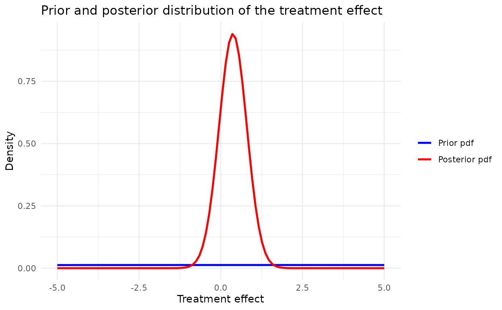

# Separate analysis

## Introduction

This vignette describes an implementation of a Bayesian analysis without
borrowing.

## Set working directory and load packages

## Load the case study configuration

Load the simulation configuration and the Belimumab case study
configuration from YAML files.

``` r

set.seed(42)
case_study_config <- yaml::yaml.load_file(system.file("conf/case_studies/belimumab.yml", package = "RBExT"))
```

### Create data objects

Create a source_data instance, where information about the source data
is stored

``` r

source_data <- ObservedSourceData$new(case_study_config)
```

Set the observed target data (in the paediatrics population)

``` r

target_data <- ObservedTargetData$new(treatment_effect_estimate = case_study_config$target$treatment_effect, treatment_effect_standard_error = case_study_config$target$standard_error, target_sample_size_per_arm = as.integer(case_study_config$target$total / 2), summary_measure_likelihood = case_study_config$summary_measure_likelihood)
```

### Create model

``` r

method <- "separate"
method_parameters <- list(
  initial_prior = "noninformative" # This corresponds to the fact that the posterior for the adults data is derived from an uninformative prior (for consistency with other methods).
)
```

Now, we define the model we want to use for inferring the treatment
effect in the target study.

``` r

model <- Model$new()

model <- model$create(
  case_study_config = case_study_config,
  method = method,
  method_parameters = method_parameters,
  source_data = source_data
)
```

### Inference

``` r

# Perform Bayesian inference based on observed target data.
model$inference(target_data = target_data)
```

    ## [1] "Success"

``` r

model$plot_pdfs(xmin = -5, xmax = 5, resolution = 100)
```


