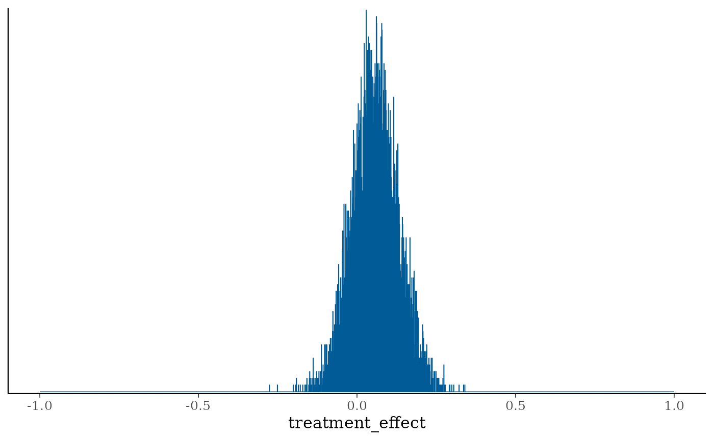
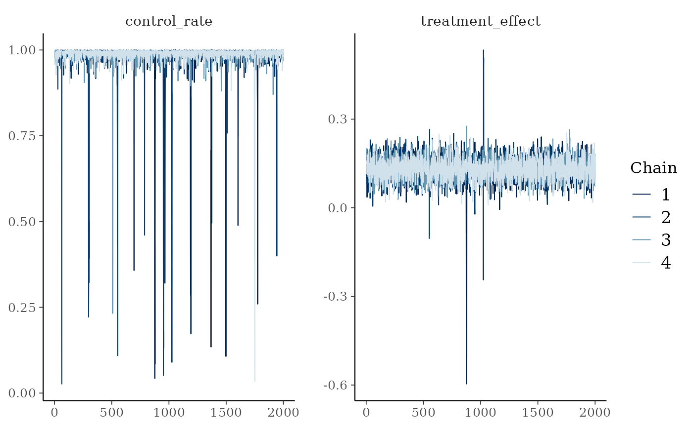
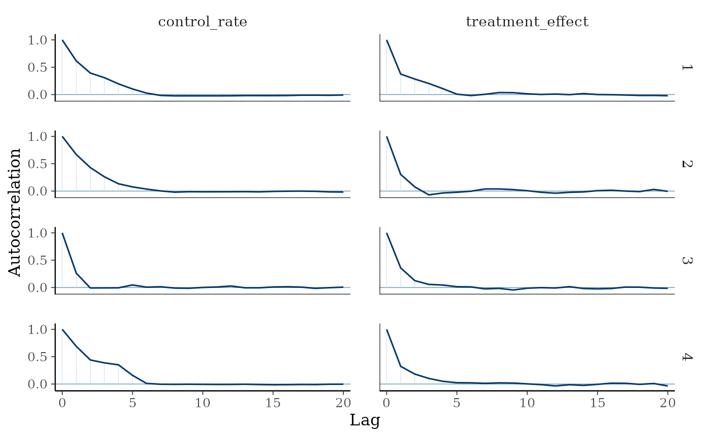
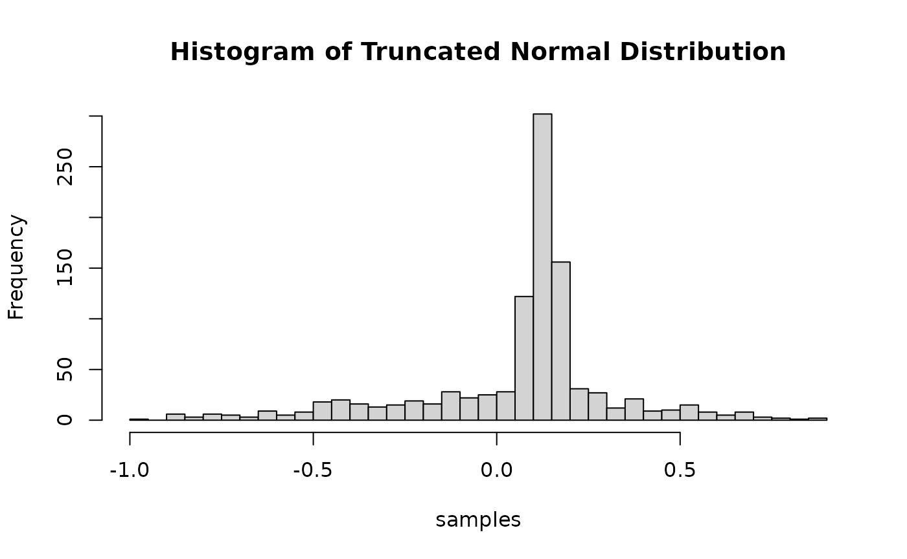
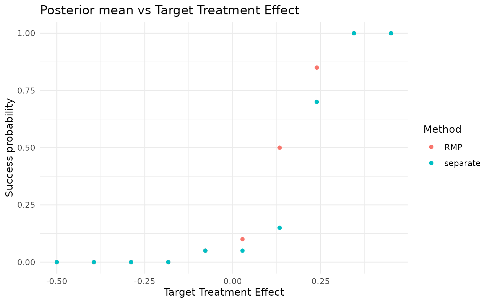
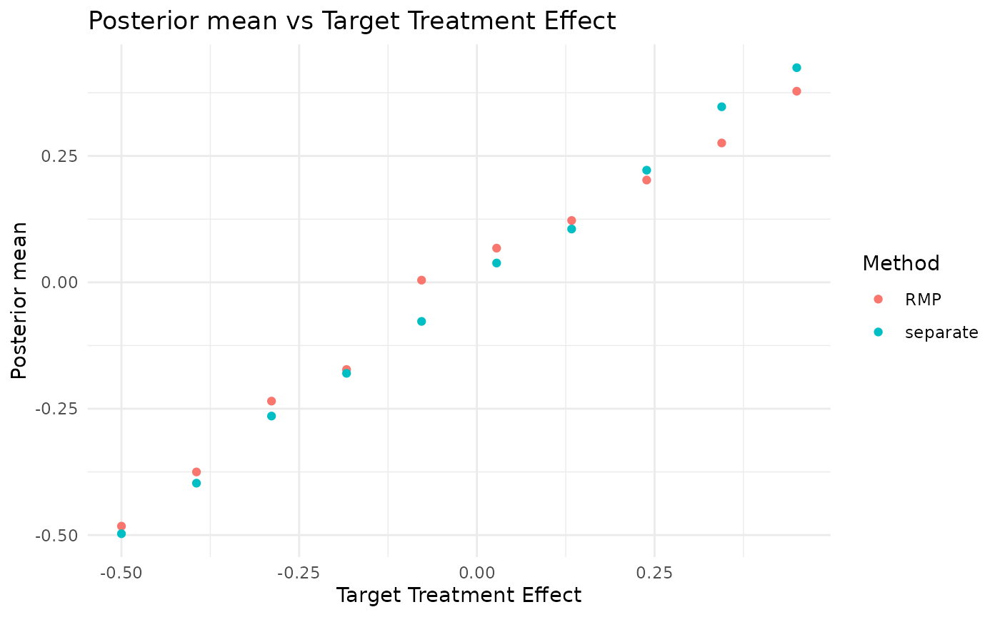

# Simulation study : RMP for binary endpoints without normal approximation for the treatment effect distribution

## Introduction

This vignette describes an implementation of the Truncated Gaussian
Robust Mixture Prior when the treatment effect is the difference between
the success rate in the treatment arm and the success rate in the
control arm.

## Set working directory, import functions and configurations

List packages to load, and install them if necessary.

## Load the data for the Aprepitant case study

``` r

set.seed(42)
config_path <- system.file("conf/simulation_config.yml", package = "RBExT")
simulation_config <- yaml::yaml.load_file(config_path)

case_study <- "aprepitant"
config_path <- system.file("conf/case_studies/aprepitant.yml", package = "RBExT")
case_study_config <- yaml::yaml.load_file(config_path)

source_data <- ObservedSourceData$new(case_study_config)


treatment_effect_standard_error <- case_study_config$target$standard_error

target_data <- ObservedTargetData$new(treatment_effect_estimate = case_study_config$target$treatment_effect, treatment_effect_standard_error = treatment_effect_standard_error, target_sample_size_per_arm = as.integer(case_study_config$target$total / 2), summary_measure_likelihood = case_study_config$summary_measure_likelihood)
```

## RMP for the rate difference

In the figure below, we represent the model used in the case where the
treatment effect is a difference of rates, with a robust mixture prior
on the treatment effect :

 The model can be
summarized as follows:

- $`y_T^{c} \sim \mathcal{B}(p_T^{c},N_T^{c})`$
- $`y_T^{t} \sim \mathcal{B}(p_T^{t},N_T^{t})`$
- $`p_T^{c} \sim \mathcal{U}(0,1)`$
- $`p_T^{t} = \theta_T - p_T^{c}`$ and we put a Truncated Gaussian
  Robust Mixture Prior on the treatment effect. This is the same logic
  as the standard Gaussian RMP, but the components are truncated between
  -1 and 1. That is :
  ``` math
  p(\theta_T |\boldsymbol{y}_S)= w\mathcal{N}(\theta_T |\mu_v, \sigma^2_v, \text{lower} = -1, \text{upper} = 1) + (1-w)\mathcal{N}(\theta_T | \overline{y}_S, \nu^2_S, \text{lower} = -1, \text{upper} = 1)
  ```
  where
  $`\mathcal{N}(\mu, \sigma^2, \text{lower} = -1, \text{upper} = 1)`$ is
  the truncated normal distribution between -1 and 1, with p.d.f.:
  ``` math
  f(x)=\frac{1}{\sigma} \frac{\varphi\left(\frac{x-\mu}{\sigma}\right)}{\Phi\left(\frac{1-\mu}{\sigma}\right)-\Phi\left(\frac{-1-\mu}{\sigma}\right)}
  ```

## Implementation of the model in Stan

Let us define the Stan model:

``` r

stan_model_code <- "
data {
  int<lower = 0> n_treatment;
  int<lower = 0> n_control;

  int<lower = 0, upper = n_treatment> successes_treatment;
  int<lower = 0, upper = n_control> successes_control;

  real<lower = 0, upper = 1> w;

  real vague_mean;
  real<lower = 0> vague_sd;
  real info_mean;
  real<lower = 0> info_sd;
}
transformed data {
  int<lower = 0, upper = 1> debug = 0;
}
parameters {
  real<lower = 0, upper = 1> control_rate;
  real<lower = - control_rate, upper = 1 - control_rate> treatment_effect;
}
transformed parameters {
  real<lower = 0, upper = 1> treatment_rate = control_rate + treatment_effect;

  real vague_normalizing_constant = normal_cdf(1-control_rate | vague_mean, vague_sd) - normal_cdf(-control_rate | vague_mean, vague_sd);
  real info_normalizing_constant = normal_cdf(1-control_rate | info_mean, info_sd) - normal_cdf(-control_rate | info_mean, info_sd);
  real log_vague_normalizing_constant = log(vague_normalizing_constant);
  real log_info_normalizing_constant = log(info_normalizing_constant);
}
model {
  // Robust mixture prior

  control_rate ~ uniform(0, 1);

  target += log_mix(w,
            normal_lpdf(treatment_effect | vague_mean, vague_sd) - log_vague_normalizing_constant,
            normal_lpdf(treatment_effect | info_mean, info_sd) - log_info_normalizing_constant);

  successes_control ~ binomial(n_control, control_rate);
  successes_treatment ~ binomial(n_treatment, treatment_rate);
}
"


# Write the Stan code to a temporary file
stan_file_path <- cmdstanr::write_stan_file(stan_model_code)

# Compile the model
mod <- cmdstanr::cmdstan_model(stan_file_path)

# Specify the parameters
data_list <- list(
  w = 0.5,
  n_treatment = case_study_config$target$treatment,
  n_control = case_study_config$target$control,
  successes_treatment = case_study_config$target$responses$treatment,
  successes_control = case_study_config$target$responses$control,
  vague_mean = 0,
  vague_sd = sqrt(target_data$sample$treatment_effect_standard_error^2 * target_data$sample_size_per_arm),
  info_mean = case_study_config$source$treatment_effect,
  info_sd = case_study_config$source$standard_error
)

print(data_list)
```

    ## $w
    ## [1] 0.5
    ## 
    ## $n_treatment
    ## [1] 55
    ## 
    ## $n_control
    ## [1] 52
    ## 
    ## $successes_treatment
    ## [1] 48
    ## 
    ## $successes_control
    ## [1] 42
    ## 
    ## $vague_mean
    ## [1] 0
    ## 
    ## $vague_sd
    ## [1] 0.3898863
    ## 
    ## $info_mean
    ## [1] 0.1315456
    ## 
    ## $info_sd
    ## [1] 0.03505291

We can now sample from the posterior:

``` r

# Sample from the posterior
fit <- mod$sample(
  data = data_list,
  chains = 4,
  parallel_chains = 4,
  iter_sampling = 2000,
  iter_warmup = 1000
)


bayesplot::mcmc_hist(fit$draws("treatment_effect"), binwidth = 0.001) + xlim(-1, 1)
```


``` r

hist(fit$draws("treatment_effect"), breaks = 10001, freq = FALSE)
```


By contrast, if we set w = 1 (equivalent to a separate analysis):

``` r

# Specify the parameters
data_list$w <- 1

# Sample from the posterior
fit <- mod$sample(
  data = data_list,
  chains = 4,
  parallel_chains = 4,
  iter_sampling = 2000,
  iter_warmup = 1000
)
```

``` r

bayesplot::mcmc_hist(fit$draws("treatment_effect"), binwidth = 0.001) + xlim(-1, 1)
```



``` r

hist(fit$draws("treatment_effect"), breaks = 10001, freq = FALSE)
```


## Sampling from the prior

Let us modify the Stan model to allow sampling from the prior
distribution of the treatment effect:

``` r

stan_prior_code <- "
data {
  real<lower = 0, upper = 1> w;

  real vague_mean;
  real<lower = 0> vague_sd;
  real info_mean;
  real<lower = 0> info_sd;
}
transformed data {
  int<lower = 0, upper = 1> debug = 0;
}
parameters {
  real<lower = 0, upper = 1> control_rate;
  real<lower = -1, upper = 1> treatment_effect;
}
transformed parameters {
  real treatment_rate = control_rate + treatment_effect;
}
model {
  // Robust mixture prior

  control_rate ~ uniform(0, 1);

  real vague_normalizing_constant = normal_cdf(1-control_rate | vague_mean, vague_sd) - normal_cdf(-control_rate | vague_mean, vague_sd);
  real info_normalizing_constant = normal_cdf(1-control_rate | info_mean, info_sd) - normal_cdf(-control_rate | info_mean, info_sd);


  real log_vague_normalizing_constant = log(vague_normalizing_constant);
  real log_info_normalizing_constant = log(info_normalizing_constant);

  target += log_mix(w,
            normal_lpdf(treatment_effect | vague_mean, vague_sd) - log_vague_normalizing_constant,
            normal_lpdf(treatment_effect | info_mean, info_sd) - log_info_normalizing_constant);
}
"


# Write the Stan code to a temporary file
stan_file_path <- cmdstanr::write_stan_file(stan_prior_code)

# Compile the model
mod <- cmdstanr::cmdstan_model(stan_file_path)

# Specify the parameters
data_list <- list(
  w = 0.5,
  vague_mean = 0,
  vague_sd = sqrt(target_data$sample$treatment_effect_standard_error^2 * target_data$sample_size_per_arm),
  info_mean = case_study_config$source$treatment_effect,
  info_sd = case_study_config$source$standard_error
)
```

We can now sample from the posterior:

``` r

# Sample from the prior
fit <- mod$sample(
  data = data_list,
  chains = 4,
  parallel_chains = 4,
  iter_sampling = 2000,
  iter_warmup = 1000
)
```

``` r

bayesplot::mcmc_hist(fit$draws("treatment_effect"), binwidth = 0.001) + xlim(-1, 1)
```


``` r

hist(fit$draws("treatment_effect"), breaks = 10001, freq = FALSE)
```


``` r

library(posterior)
draws_array <- as_draws_array(fit)
```

``` r

library(bayesplot)
mcmc_trace(draws_array, pars = c("control_rate", "treatment_effect"))
```



``` r

mcmc_acf(draws_array, pars = c("control_rate", "treatment_effect"))
```



Actually, in the case of a mixture of truncated normal distributions, we
can more easily sample directly from the prior using the truncnorm
package.

``` r

# Load the truncnorm package
library(truncnorm)

n_samples <- 1000
w <- 0.5
vague_prior_mean <- 0
vague_prior_sd <- sqrt(target_data$sample$treatment_effect_standard_error^2 * target_data$sample_size_per_arm)
info_prior_mean <- case_study_config$source$treatment_effect
info_prior_sd <- case_study_config$source$standard_error

component_choice <- sample(
  x = c(0, 1),
  size = n_samples,
  replace = TRUE,
  prob = c(1 - w, w)
)

samples <- rep(0, n_samples)

lower <- -1 # Lower truncation point
upper <- 1 # Upper truncation point

samples[component_choice == 0] <- rtruncnorm(
  n = sum(component_choice == 0),
  mean = vague_prior_mean,
  sd = vague_prior_sd,
  a = lower,
  b = upper
)

samples[component_choice == 1] <- rtruncnorm(
  n = sum(component_choice == 1),
  mean = info_prior_mean,
  sd = info_prior_sd,
  a = lower,
  b = upper
)


# Plot the histogram of the samples
hist(samples, breaks = 30, main = "Histogram of Truncated Normal Distribution")
```



### Simulation

Separate analysis:

``` r

separate_method <- "separate"
method_parameters <- list(
  initial_prior = "noninformative", # This corresponds to the fact that the posterior for the adults data is derived from an uninformative prior (for consistency with other methods).
  empirical_bayes = FALSE # Corresponds to whether some parameters of the prior are based on observed data.
)

env <- "full"
config_dir <- paste0(system.file(paste0("conf/", env), package = "RBExT"), "/")
mcmc_config <- yaml::read_yaml(paste0(config_dir, "/mcmc_config.yml"))

separate_model <- Model$new()

separate_model <- separate_model$create(
  case_study_config = case_study_config,
  method = separate_method,
  method_parameters = method_parameters,
  source_data = source_data,
  mcmc_config = mcmc_config
)

target_sample_size_per_arm <- as.integer(case_study_config$target$total / 2)

# The truncated RMP itself, which the simulation below compares against the
# separate analysis. prior_weight is the weight on the informative component,
# matching the w used for the prior samples above.
method <- "RMP"
rmp_method_parameters <- list(
  initial_prior = "noninformative",
  prior_weight = 0.5,
  empirical_bayes = FALSE
)

model <- Model$new()

model <- model$create(
  case_study_config = case_study_config,
  method = method,
  method_parameters = rmp_method_parameters,
  source_data = source_data,
  mcmc_config = mcmc_config
)
```

``` r

# The treatment effect is a difference of rates, so the grid has to keep both
# arm rates inside [0, 1]. That caps it at roughly [-0.53, 0.47] for this case
# study, unlike the unbounded log odds ratio grid the Gaussian RMP vignette uses.
treatment_effect_values <- seq(-0.5, 0.45, length.out = 10)

n <- length(treatment_effect_values)
confidence_level <- simulation_config$confidence_level
null_space <- case_study_config$null_space

# Each RMP replicate is a full MCMC fit, so this stays small to keep the
# documentation build quick. Raise it for a smoother success-probability curve.
n_replicates <- 20

separate_test_decisions <- matrix(rep(0, n * n_replicates), nrow = n)
separate_posterior_means <- matrix(rep(0, n * n_replicates), nrow = n)
separate_posterior_medians <- matrix(rep(0, n * n_replicates), nrow = n)
separate_credible_intervals <- array(rep(0, n * n_replicates * 2), dim = c(n, n_replicates, 2))
separate_prior_proba_no_benefit <- rep(0, n)

theta_0 <- case_study_config$theta_0

critical_value <- simulation_config$critical_value


for (i in seq_along(treatment_effect_values)) {
  drift <- treatment_effect_values[i] - source_data$treatment_effect_estimate
  target_data <- TargetDataFactory$new()

  target_data <- target_data$create(source_data = source_data, case_study_config = case_study_config, target_sample_size_per_arm = target_sample_size_per_arm, treatment_drift = drift, summary_measure_likelihood = source_data$summary_measure_likelihood)

  results <- separate_model$simulation_for_given_treatment_effect(target_data = target_data, n_replicates = n_replicates, critical_value = critical_value, theta_0 = theta_0, confidence_level = confidence_level, null_space = null_space, to_return = c("test_decision", "posterior_mean", "posterior_median", "credible_interval"), method = method, case_study = case_study, n_samples_quantiles_estimation = simulation_config$n_samples_quantiles_estimation)

  separate_test_decisions[i, ] <- results$test_decisions
  separate_posterior_means[i, ] <- results$posterior_means
  separate_posterior_medians[i, ] <- results$posterior_medians
  separate_credible_intervals[i, , ] <- matrix(results$credible_intervals, nrow = n_replicates)
}
```

``` r

test_decisions <- matrix(rep(0, n * n_replicates), nrow = n)
posterior_means <- matrix(rep(0, n * n_replicates), nrow = n)
posterior_medians <- matrix(rep(0, n * n_replicates), nrow = n)
credible_intervals <- array(rep(0, n * n_replicates * 2), dim = c(n, n_replicates, 2))
prior_proba_no_benefit <- rep(0, n)

for (i in seq_along(treatment_effect_values)) {
  drift <- treatment_effect_values[i] - source_data$treatment_effect_estimate # This implies that target_data$treatment_effect <- treatment_effect_values[i]
  target_data <- TargetDataFactory$new()

  target_data <- target_data$create(source_data = source_data, case_study_config = case_study_config, target_sample_size_per_arm = target_sample_size_per_arm, treatment_drift = drift, summary_measure_likelihood = source_data$summary_measure_likelihood)

  # target_data$sampling_approximation <- TRUE
  results <- model$simulation_for_given_treatment_effect(target_data = target_data, n_replicates = n_replicates, critical_value = critical_value, theta_0 = theta_0, confidence_level = confidence_level, null_space = null_space, to_return = c("test_decision", "posterior_mean", "posterior_median", "credible_interval"),  method = method, case_study = case_study, n_samples_quantiles_estimation = simulation_config$n_samples_quantiles_estimation)

  test_decisions[i, ] <- results$test_decisions
  posterior_means[i, ] <- results$posterior_means
  posterior_medians[i, ] <- results$posterior_medians
  credible_intervals[i, , ] <- matrix(results$credible_intervals, nrow = n_replicates)
}
```

``` r

conditional_proba_success <- rowMeans(test_decisions) # Contains Pr(Study success | theta_T)
data <- data.frame(conditional_proba_success = conditional_proba_success, treatment_effect_values = treatment_effect_values, method = method)

separate_conditional_proba_success <- rowMeans(separate_test_decisions) # Contains Pr(Study success | theta_T)

separate_data <- data.frame(conditional_proba_success = separate_conditional_proba_success, treatment_effect_values = treatment_effect_values, method = separate_method)

combined_data <- rbind(data, separate_data)

plt <- ggplot(combined_data, aes(x = treatment_effect_values, y = conditional_proba_success, color = method)) +
  geom_point() +
  ggplot2::labs(
    title = "Posterior mean vs Target Treatment Effect",
    x = "Target Treatment Effect",
    y = "Success probability",
    color = "Method"
  ) +
  theme_minimal()

print(plt)
```



``` r

separate_conditional_posterior_means <- rowMeans(separate_posterior_means)
separate_data <- data.frame(conditional_posterior_means = separate_conditional_posterior_means, treatment_effect_values = treatment_effect_values, method = separate_method)

conditional_posterior_means <- rowMeans(posterior_means)
data <- data.frame(conditional_posterior_means = conditional_posterior_means, treatment_effect_values = treatment_effect_values, method = method)

combined_data <- rbind(data, separate_data)

plt <- ggplot(combined_data, aes(x = treatment_effect_values, y = conditional_posterior_means, color = method)) +
  geom_point() +
  ggplot2::labs(
    title = "Posterior mean vs Target Treatment Effect",
    x = "Target Treatment Effect",
    y = "Posterior mean",
    color = "Method"
  ) +
  theme_minimal()

print(plt)
```



``` r

sessionInfo()
```

    ## R version 4.2.0 (2022-04-22)
    ## Platform: x86_64-pc-linux-gnu (64-bit)
    ## Running under: Ubuntu 24.04.5 LTS
    ## 
    ## Matrix products: default
    ## BLAS:   /usr/lib/x86_64-linux-gnu/openblas-pthread/libblas.so.3
    ## LAPACK: /usr/lib/x86_64-linux-gnu/openblas-pthread/libopenblasp-r0.3.26.so
    ## 
    ## locale:
    ##  [1] LC_CTYPE=C.UTF-8       LC_NUMERIC=C           LC_TIME=C.UTF-8       
    ##  [4] LC_COLLATE=C.UTF-8     LC_MONETARY=C.UTF-8    LC_MESSAGES=C.UTF-8   
    ##  [7] LC_PAPER=C.UTF-8       LC_NAME=C              LC_ADDRESS=C          
    ## [10] LC_TELEPHONE=C         LC_MEASUREMENT=C.UTF-8 LC_IDENTIFICATION=C   
    ## 
    ## attached base packages:
    ## [1] stats     graphics  grDevices datasets  utils     methods   base     
    ## 
    ## other attached packages:
    ## [1] truncnorm_1.0-9       bayesplot_1.16.0.9000 posterior_1.7.1      
    ## [4] cmdstanr_0.9.0        ggplot2_4.0.3         RBExT_0.0.2          
    ## 
    ## loaded via a namespace (and not attached):
    ##   [1] matrixStats_1.5.0    fs_2.1.0             assertions_0.3.0    
    ##   [4] progress_1.2.3       doParallel_1.0.17    RColorBrewer_1.1-3  
    ##   [7] rstan_2.32.7         latex2exp_0.9.8      tensorA_0.36.2.1    
    ##  [10] tools_4.2.0          backports_1.5.1      bslib_0.12.0        
    ##  [13] R6_2.6.1             otel_0.2.0           withr_3.0.3         
    ##  [16] prettyunits_1.2.0    tidyselect_1.2.1     gridExtra_2.3.1     
    ##  [19] processx_3.9.0       compiler_4.2.0       extrafontdb_1.1     
    ##  [22] textshaping_1.0.5    cli_3.6.6            HDInterval_0.2.4    
    ##  [25] xml2_1.6.0           desc_1.4.3           labeling_0.4.3      
    ##  [28] sass_0.4.10          scales_1.4.0         checkmate_2.3.4     
    ##  [31] mvtnorm_1.4-2        S7_0.2.2             readr_2.2.0         
    ##  [34] pkgdown_2.2.1        QuickJSR_1.11.0      systemfonts_1.3.2   
    ##  [37] stringr_1.6.0        digest_0.6.39        StanHeaders_2.39.1  
    ##  [40] rmarkdown_2.32       svglite_2.2.2        pkgconfig_2.0.3     
    ##  [43] htmltools_0.5.9      extrafont_0.20       fastmap_1.2.0       
    ##  [46] pwr_1.3-0            htmlwidgets_1.6.4    rlang_1.3.0         
    ##  [49] rstudioapi_0.19.0    jquerylib_0.1.4      farver_2.1.2        
    ##  [52] generics_0.1.4       jsonlite_2.0.0       dplyr_1.2.1         
    ##  [55] distributional_0.9.0 inline_0.3.21        magrittr_2.0.5      
    ##  [58] kableExtra_1.4.1     Formula_1.2-6        loo_2.10.1.9000     
    ##  [61] Rcpp_1.1.2           abind_1.4-8          viridis_0.6.5       
    ##  [64] lifecycle_1.0.5      stringi_1.8.9        yaml_2.3.12         
    ##  [67] plyr_1.8.9           pkgbuild_1.4.8       grid_4.2.0          
    ##  [70] parallel_4.2.0       crayon_1.5.3         hms_1.1.4           
    ##  [73] knitr_1.52           ps_1.9.3             pillar_1.11.1       
    ##  [76] reshape2_1.4.5       codetools_0.2-18     stats4_4.2.0        
    ##  [79] rstantools_2.7.1     glue_1.8.1           evaluate_1.0.5      
    ##  [82] data.table_1.18.6.1  renv_1.0.11          RcppParallel_6.2.1  
    ##  [85] vctrs_0.7.3          tzdb_0.5.0           Rdpack_2.6.6        
    ##  [88] foreach_1.5.2        Rttf2pt1_1.3.14      gtable_0.3.6        
    ##  [91] purrr_1.2.2          tidyr_1.3.2          assertthat_0.2.1    
    ##  [94] cachem_1.1.0         xfun_0.60            rbibutils_2.4.1     
    ##  [97] tidyverse_2.0.0      roxygen2_8.1.0       ragg_1.5.2          
    ## [100] viridisLite_0.4.3    Bolstad2_1.0-29      RBesT_1.11-0        
    ## [103] tibble_3.3.1         iterators_1.0.14
