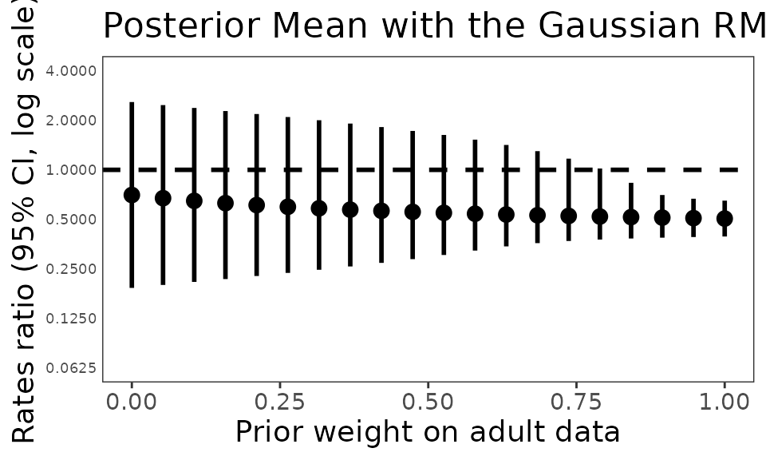
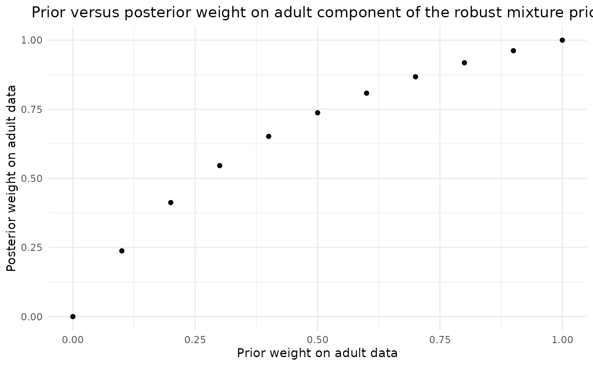
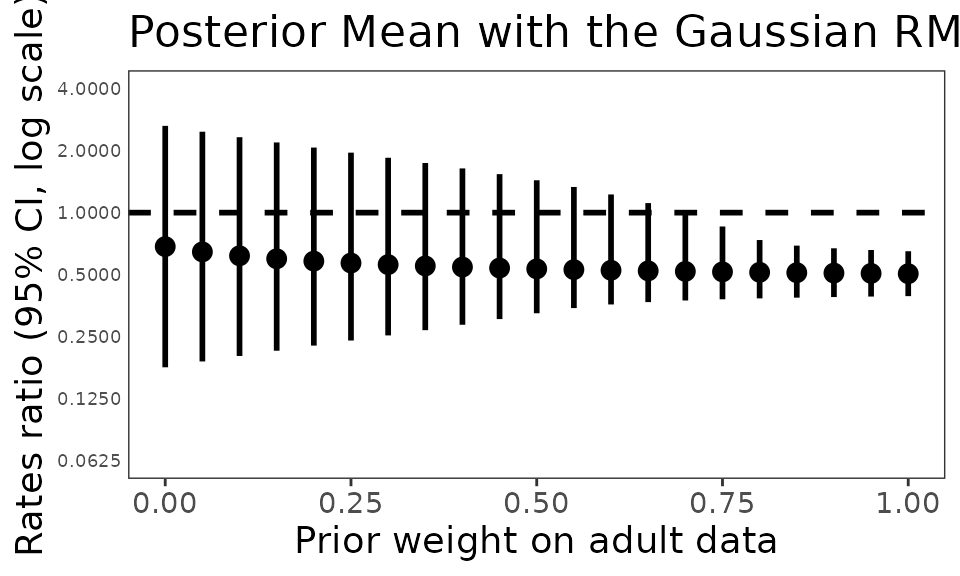
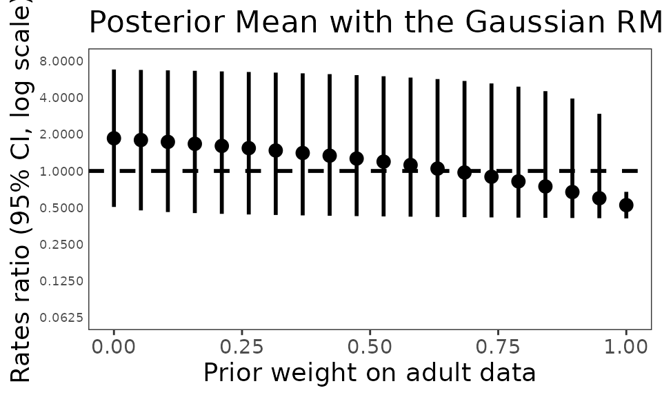
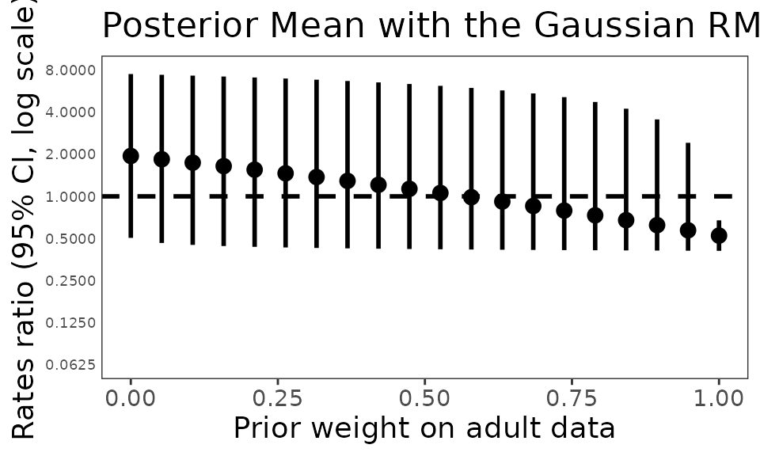
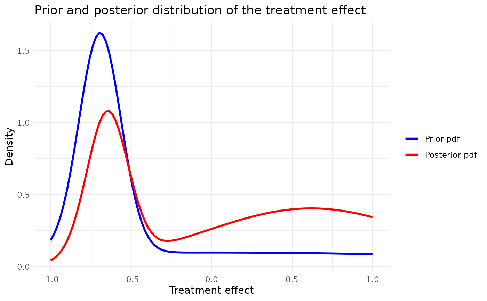

# Replication of the Mepolizumab case study

## Introduction

This code replicates the analysis presented in [Best et al
(2021)](https://onlinelibrary.wiley.com/doi/10.1002/pst.2093).

### Set working directory, import functions and configurations

Load the Mepolizumab case study configuration from YAML files.

``` r

set.seed(42)
config_path <- system.file("conf/case_studies/mepolizumab.yml", package = "RBExT")
case_study_config <- yaml::yaml.load_file(config_path)
```

### Define the method used (RMP) and the range of parameters considered

Define the range of values considered for the weight on the informative
component of the RMP

``` r

method <- "RMP"
Nw <- 20
w_range <- seq(0, 1, length.out = Nw)
```

Define the method’s parameters

``` r

method_parameters <- list(
  initial_prior = "noninformative", # This corresponds to the fact that the posterior for the adults data is derived from an uninformative prior (for consistency with other methods). May be removed in future releases.
  prior_weight = 0.5, # weight on the informative component of the mixture
  empirical_bayes = FALSE
)
```

Set the vague component variance using the target data variance (as in
[Best et al
(2021)](https://onlinelibrary.wiley.com/doi/10.1002/pst.2093) for
Mepolizumab). The vague prior corresponds to the information provided by
a single subject.

``` r

vague_prior_variance <- case_study_config$target$standard_error^2 * case_study_config$target$total
# This is obtained by setting
empirical_bayes <- TRUE
```

### Create data objects

Create a source_data instance, where information about the source data
is stored

``` r

source_data <- ObservedSourceData$new(case_study_config)
```

Set the observed target data (in the paediatrics population)

``` r

target_data <- ObservedTargetData$new(treatment_effect_estimate = case_study_config$target$treatment_effect, treatment_effect_standard_error = case_study_config$target$standard_error, target_sample_size_per_arm = as.integer(case_study_config$target$total / 2), summary_measure_likelihood = case_study_config$summary_measure_likelihood)

print(target_data$sample)
```

    ## $treatment_effect_estimate
    ## [1] -0.395
    ## 
    ## $treatment_effect_standard_error
    ## [1] 0.703

``` r

n_paediatrics <- as.integer(case_study_config$target$total / 2)
```

``` math
\text { Robust mixture prior }  =w \times \operatorname{Normal}\left(m_{\text {adult }}, v_{\text {adult }}\right)+(1-w) \times \operatorname{Normal}\left(m_{\text {weak }}, v_{\text {weak }}\right) 
```

``` math
 \text { Robust mixture prior }=w \times \operatorname{Normal}(-0.694,0.017)+(1-w) \times \operatorname{Normal}(0,12.4)
```

Note that, at the moment, the code does not allow specifying different
sample sizes for the arms of the target study.

## Inference

For each parameter, instantiate a model, perform Bayesian inference and
compute the posterior mean and credible interval.

The model instantiation relies on the so-called factory design pattern
for increased ease of use and flexibility.

``` r

n_samples_posterior <- 10000000

point_est <- numeric(Nw)
credible_intervals <- matrix(NA, 2, Nw)
confidence_level <- 0.95
lower_quantile <- (1 - confidence_level) / 2
upper_quantile <- 1 - lower_quantile

posterior_w <- numeric(Nw)

for (i in seq_along(w_range)) {
  method_parameters$prior_weight <- w_range[i]

  model <- Model$new()
  model <- model$create(
    case_study_config = case_study_config,
    method = method,
    method_parameters = method_parameters,
    source_data = source_data
  )

  model$vague_prior_variance <- n_paediatrics * target_data$sample$treatment_effect_standard_error^2 # Following Best et al, 2021.

  # Perform Bayesian inference based on observed target data.
  model$inference(target_data = target_data)

  # Convert the estimates back to the natural scale
  point_est[i] <- exp(model$posterior_mean())

  # To estimate the credible intervals, we sample from the posterior distribution
  posterior_samples <- exp(model$sample_posterior(n_samples_posterior))
  credible_intervals[, i] <- quantile(posterior_samples, probs = c(lower_quantile, upper_quantile))
  posterior_w[i] <- model$wpost
}
```

### Plot results

We plot the results as in the original paper by [Best et al
(2021)](https://onlinelibrary.wiley.com/doi/10.1002/pst.2093).

``` r

ggplot2::ggplot() +
  geom_errorbar(
    ggplot2::aes(
      x = w_range,
      y = point_est,
      ymin = credible_intervals[1, ],
      ymax = credible_intervals[2, ]
    ),
    color = "black", linewidth = 1, width = 0
  ) +
  geom_point(ggplot2::aes(x = w_range, y = point_est), color = "black", size = 3) +
  geom_hline(yintercept = 1, linetype = "dashed", linewidth = 1) +
  ggplot2::labs(
    x = "Prior weight on adult data",
    y = "Rates ratio (95% CI, log scale)",
    title = "Posterior Mean with the Gaussian RMP"
  ) +
  scale_y_log10(limits = c(0.0625, 4), breaks = c(0.0625, 0.125, 0.25, 0.5, 1, 2, 4)) +
  theme_bw() +
  theme(
    text = element_text(size = 14),
    axis.text.y = element_text(size = 7),
    axis.ticks.y = element_blank(),
    strip.text.x = element_text(size = 10),
    legend.key = element_blank(),
    strip.background = element_blank(),
    panel.grid.major = element_blank(),
    panel.grid.minor = element_blank()
  )
```



### Table summarizing the results

[Best et al
(2021)](https://onlinelibrary.wiley.com/doi/10.1002/pst.2093) presents a
table summarizing the results of inference for various prior weights.

``` r

data <- data.frame(
  "Prior weight on adult data" = seq(0, 1, by = 0.1),
  "Rate Ratio (95% CrI) (Mepo/Placebo)" = c(
    "0.68 (0.18, 2.64)",
    "0.55 (0.20, 2.33)",
    "0.53 (0.23, 2.07)",
    "0.52 (0.25, 1.85)",
    "0.51 (0.28, 1.64)",
    "0.51 (0.32, 1.44)",
    "0.51 (0.36, 1.23)",
    "0.51 (0.37, 0.99)",
    "0.51 (0.38, 0.74)",
    "0.51 (0.39, 0.67)",
    "0.50 (0.39, 0.65)"
  ),
  check.names = FALSE
)

# Create and style the table
kable(data, "html") %>%
  kableExtra::kable_styling("striped", full_width = F)
```

| Prior weight on adult data | Rate Ratio (95% CrI) (Mepo/Placebo) |
|---------------------------:|:------------------------------------|
|                        0.0 | 0.68 (0.18, 2.64)                   |
|                        0.1 | 0.55 (0.20, 2.33)                   |
|                        0.2 | 0.53 (0.23, 2.07)                   |
|                        0.3 | 0.52 (0.25, 1.85)                   |
|                        0.4 | 0.51 (0.28, 1.64)                   |
|                        0.5 | 0.51 (0.32, 1.44)                   |
|                        0.6 | 0.51 (0.36, 1.23)                   |
|                        0.7 | 0.51 (0.37, 0.99)                   |
|                        0.8 | 0.51 (0.38, 0.74)                   |
|                        0.9 | 0.51 (0.39, 0.67)                   |
|                        1.0 | 0.50 (0.39, 0.65)                   |

``` r

Nw <- 11
w_range <- seq(0, 1, length.out = Nw)
point_est <- numeric(Nw)
credible_intervals <- matrix(NA, 2, Nw)
confidence_level <- 0.95
lower_quantile <- (1 - confidence_level) / 2
upper_quantile <- 1 - lower_quantile

posterior_w <- numeric(Nw)

for (i in seq_along(w_range)) {
  method_parameters$prior_weight <- w_range[i]

  model <- Model$new()
  model <- model$create(
    case_study_config = case_study_config,
    method = method,
    method_parameters = method_parameters,
    source_data = source_data
  )
  model$vague_prior_variance <- n_paediatrics * target_data$sample$treatment_effect_standard_error^2 # Following Best et al, 2021.

  # Perform Bayesian inference based on observed target data.
  model$inference(target_data = target_data)

  # Convert the estimates back to the natural scale
  point_est[i] <- exp(model$posterior_mean())

  # To estimate the credible intervals, we sample from the posterior distribution
  posterior_samples <- exp(model$sample_posterior(n_samples_posterior))
  credible_intervals[, i] <- quantile(posterior_samples, probs = c(lower_quantile, upper_quantile))
  posterior_w[i] <- model$wpost
}


point_est <- round(point_est, 2)
credible_intervals <- round(credible_intervals, 2)

data <- data.frame(
  `Prior weight on adult data` = w_range,
  `Rate Ratio (95% CrI) (Mepo/Placebo)` = paste(
    point_est,
    paste0("(", round(credible_intervals[1, ], 2), ", ", round(credible_intervals[2, ], 2), ")")
  ),
  check.names = FALSE
)
# Create and style the table
kable(data, "html", escape = FALSE) %>%
  kableExtra::kable_styling("striped", full_width = F)
```

| Prior weight on adult data | Rate Ratio (95% CrI) (Mepo/Placebo) |
|---------------------------:|:------------------------------------|
|                        0.0 | 0.7 (0.19, 2.58)                    |
|                        0.1 | 0.65 (0.21, 2.39)                   |
|                        0.2 | 0.61 (0.22, 2.2)                    |
|                        0.3 | 0.59 (0.24, 2.03)                   |
|                        0.4 | 0.57 (0.27, 1.86)                   |
|                        0.5 | 0.55 (0.29, 1.68)                   |
|                        0.6 | 0.54 (0.33, 1.48)                   |
|                        0.7 | 0.53 (0.36, 1.26)                   |
|                        0.8 | 0.52 (0.38, 0.99)                   |
|                        0.9 | 0.51 (0.39, 0.7)                    |
|                        1.0 | 0.5 (0.39, 0.65)                    |

### Posterior weight vs prior weight

[Best et al
(2021)](https://onlinelibrary.wiley.com/doi/10.1002/pst.2093) contains a
figure representing the posterior weight on adult data as a function of
the prior weight on adult data.

``` r

data <- data.frame(
  w = w_range,
  posterior_w = posterior_w
)

scatter_plot <- ggplot2::ggplot(data, ggplot2::aes(x = w_range, y = posterior_w)) +
  geom_point() +
  ggtitle("Prior versus posterior weight on adult component of the robust mixture prior") +
  xlab("Prior weight on adult data") +
  ylab("Posterior weight on adult data") +
  theme_minimal() +
  theme(plot.title = element_text(hjust = 0.5))

print(scatter_plot)
```



## Comparison with RBesT

``` r

Nw <- 21
w_range <- seq(0, 1, length.out = Nw)
point_est <- numeric(Nw)
credible_intervals <- matrix(NA, 2, Nw)
confidence_level <- 0.95
lower_quantile <- (1 - confidence_level) / 2
upper_quantile <- 1 - lower_quantile

posterior_w <- numeric(Nw)

for (i in seq_along(w_range)) {
  prior.sri <- RBesT::mixnorm(c(w_range[i], source_data$treatment_effect_estimate, sqrt(0.017)), c(1 - w_range[i], 0, sqrt(12.4)))
  post.sri <- RBesT::postmix(prior.sri, m = target_data$sample$treatment_effect_estimate, se = target_data$sample$treatment_effect_standard_error)
  res.sri <- summary(post.sri)

  # Convert the estimates back to the natural scale
  point_est[i] <- exp(res.sri["mean"])

  credible_intervals[, i] <- c(exp(res.sri[3]), exp(res.sri[5]))
}
```

``` r

ggplot2::ggplot() +
  geom_errorbar(
    ggplot2::aes(
      x = w_range,
      y = point_est,
      ymin = credible_intervals[1, ],
      ymax = credible_intervals[2, ]
    ),
    color = "black", linewidth = 1, width = 0
  ) +
  geom_point(ggplot2::aes(x = w_range, y = point_est), color = "black", size = 3) +
  geom_hline(yintercept = 1, linetype = "dashed", linewidth = 1) +
  ggplot2::labs(
    x = "Prior weight on adult data",
    y = "Rates ratio (95% CI, log scale)",
    title = "Posterior Mean with the Gaussian RMP"
  ) +
  scale_y_log10(limits = c(0.0625, 4), breaks = c(0.0625, 0.125, 0.25, 0.5, 1, 2, 4)) +
  theme_bw() +
  theme(
    text = element_text(size = 14),
    axis.text.y = element_text(size = 7),
    axis.ticks.y = element_blank(),
    strip.text.x = element_text(size = 10),
    legend.key = element_blank(),
    strip.background = element_blank(),
    panel.grid.major = element_blank(),
    panel.grid.minor = element_blank()
  )
```



``` r

Nw <- 11
w_range <- seq(0, 1, length.out = Nw)
point_est <- numeric(Nw)
credible_intervals <- matrix(NA, 2, Nw)
confidence_level <- 0.95
lower_quantile <- (1 - confidence_level) / 2
upper_quantile <- 1 - lower_quantile

posterior_w <- numeric(Nw)

for (i in seq_along(w_range)) {
  prior.sri <- RBesT::mixnorm(c(w_range[i], source_data$treatment_effect_estimate, sqrt(0.017)), c(1 - w_range[i], 0, sqrt(12.4)))
  post.sri <- RBesT::postmix(prior.sri, m = target_data$sample$treatment_effect_estimate, se = target_data$sample$treatment_effect_standard_error)
  res.sri <- summary(post.sri)


  model$vague_prior_variance <- n_paediatrics * target_data$sample$treatment_effect_standard_error^2 # Following Best et al, 2021.

  # Perform Bayesian inference based on observed target data.
  model$inference(target_data = target_data)

  # Convert the estimates back to the natural scale
  point_est[i] <- exp(res.sri["mean"])

  # To estimate the credible intervals, we sample from the posterior distribution
  posterior_samples <- exp(RBesT::rmix(post.sri, n = n_samples_posterior))
  credible_intervals[, i] <- quantile(posterior_samples, probs = c(lower_quantile, upper_quantile))
}

point_est <- round(point_est, 2)
credible_intervals <- round(credible_intervals, 2)

data <- data.frame(
  `Prior weight on adult data` = w_range,
  `Rate Ratio (95% CrI) (Mepo/Placebo)` = paste(
    point_est,
    paste0("(", round(credible_intervals[1, ], 2), ", ", round(credible_intervals[2, ], 2), ")")
  ),
  check.names = FALSE
)
# Create and style the table
kable(data, "html", escape = FALSE) %>%
  kableExtra::kable_styling("striped", full_width = F)
```

| Prior weight on adult data | Rate Ratio (95% CrI) (Mepo/Placebo) |
|---------------------------:|:------------------------------------|
|                        0.0 | 0.68 (0.18, 2.64)                   |
|                        0.1 | 0.62 (0.2, 2.33)                    |
|                        0.2 | 0.58 (0.23, 2.07)                   |
|                        0.3 | 0.56 (0.25, 1.85)                   |
|                        0.4 | 0.54 (0.29, 1.64)                   |
|                        0.5 | 0.53 (0.32, 1.44)                   |
|                        0.6 | 0.52 (0.36, 1.23)                   |
|                        0.7 | 0.52 (0.37, 0.99)                   |
|                        0.8 | 0.51 (0.38, 0.74)                   |
|                        0.9 | 0.51 (0.39, 0.67)                   |
|                        1.0 | 0.5 (0.39, 0.65)                    |

## Other treatment effect values in the target study

In Figure 5 of [Best et al
(2021)](https://onlinelibrary.wiley.com/doi/10.1002/pst.2093), several
other values are considered for the RR in adolescents (2, 1.25, 0.9,
0.3):

``` r

target_data$sample$treatment_effect_estimate <- log(2)


Nw <- 20
point_est <- numeric(Nw)
w_range <- seq(0, 1, length.out = Nw)
credible_intervals <- matrix(NA, 2, Nw)

posterior_w <- numeric(Nw)

for (i in seq_along(w_range)) {
  method_parameters$prior_weight <- w_range[i]

  model <- Model$new()
  model <- model$create(
    case_study_config = case_study_config,
    method = method,
    method_parameters = method_parameters,
    source_data = source_data
  )

  model$vague_prior_variance <- n_paediatrics * target_data$sample$treatment_effect_standard_error^2 # Following Best et al, 2021.

  # Perform Bayesian inference based on observed target data.
  model$inference(target_data = target_data)

  # Convert the estimates back to the natural scale
  point_est[i] <- exp(model$posterior_mean())

  # To estimate the credible intervals, we sample from the posterior distribution
  posterior_samples <- exp(model$sample_posterior(n_samples_posterior))
  credible_intervals[, i] <- quantile(posterior_samples, probs = c(lower_quantile, upper_quantile))
  posterior_w[i] <- model$wpost
}
```

## Plot results

We plot the results as in the original paper by [Best et al
(2021)](https://onlinelibrary.wiley.com/doi/10.1002/pst.2093)

``` r

ggplot2::ggplot() +
  geom_errorbar(
    ggplot2::aes(
      x = w_range,
      y = point_est,
      ymin = credible_intervals[1, ],
      ymax = credible_intervals[2, ]
    ),
    color = "black", linewidth = 1, width = 0
  ) +
  geom_point(ggplot2::aes(x = w_range, y = point_est), color = "black", size = 3) +
  geom_hline(yintercept = 1, linetype = "dashed", linewidth = 1) +
  ggplot2::labs(
    x = "Prior weight on adult data",
    y = "Rates ratio (95% CI, log scale)",
    title = "Posterior Mean with the Gaussian RMP"
  ) +
  scale_y_log10(limits = c(0.0625, 8), breaks = c(0.0625, 0.125, 0.25, 0.5, 1, 2, 4, 8)) +
  theme_bw() +
  theme(
    text = element_text(size = 14),
    axis.text.y = element_text(size = 7),
    axis.ticks.y = element_blank(),
    strip.text.x = element_text(size = 10),
    legend.key = element_blank(),
    strip.background = element_blank(),
    panel.grid.major = element_blank(),
    panel.grid.minor = element_blank()
  )
```



Comparison with RBesT:

``` r

Nw <- 20
w_range <- seq(0, 1, length.out = Nw)
point_est <- numeric(Nw)
credible_intervals <- matrix(NA, 2, Nw)
confidence_level <- 0.95
lower_quantile <- (1 - confidence_level) / 2
upper_quantile <- 1 - lower_quantile

posterior_w <- numeric(Nw)

for (i in seq_along(w_range)) {
  prior.sri <- RBesT::mixnorm(c(w_range[i], source_data$treatment_effect_estimate, sqrt(0.017)), c(1 - w_range[i], 0, sqrt(12.4)))
  post.sri <- RBesT::postmix(prior.sri, m = target_data$sample$treatment_effect_estimate, se = target_data$sample$treatment_effect_standard_error)
  res.sri <- summary(post.sri)

  # Convert the estimates back to the natural scale
  point_est[i] <- exp(res.sri["mean"])

  credible_intervals[, i] <- c(exp(res.sri[3]), exp(res.sri[5]))
}
```

``` r

ggplot2::ggplot() +
  geom_errorbar(
    ggplot2::aes(
      x = w_range,
      y = point_est,
      ymin = credible_intervals[1, ],
      ymax = credible_intervals[2, ]
    ),
    color = "black", linewidth = 1, width = 0
  ) +
  geom_point(ggplot2::aes(x = w_range, y = point_est), color = "black", size = 3) +
  geom_hline(yintercept = 1, linetype = "dashed", linewidth = 1) +
  ggplot2::labs(
    x = "Prior weight on adult data",
    y = "Rates ratio (95% CI, log scale)",
    title = "Posterior Mean with the Gaussian RMP"
  ) +
  scale_y_log10(limits = c(0.0625, 8), breaks = c(0.0625, 0.125, 0.25, 0.5, 1, 2, 4, 8)) +
  theme_bw() +
  theme(
    text = element_text(size = 14),
    axis.text.y = element_text(size = 7),
    axis.ticks.y = element_blank(),
    strip.text.x = element_text(size = 10),
    legend.key = element_blank(),
    strip.background = element_blank(),
    panel.grid.major = element_blank(),
    panel.grid.minor = element_blank()
  )
```



Posterior and prior pdf :

``` r

method_parameters$prior_weight <- 0.5

model <- Model$new()
model <- model$create(
  case_study_config = case_study_config,
  method = method,
  method_parameters = method_parameters,
  source_data = source_data
)

# Perform Bayesian inference based on observed target data.
model$inference(target_data = target_data)
```

    ## [1] "Success"

``` r

model$plot_pdfs(xmin = -1, xmax = 1, resolution = 100)
```


